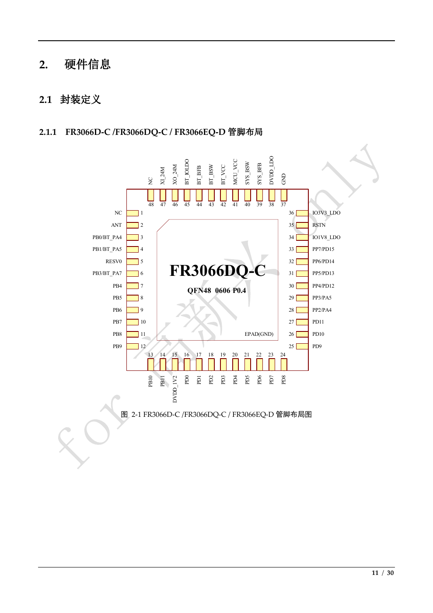
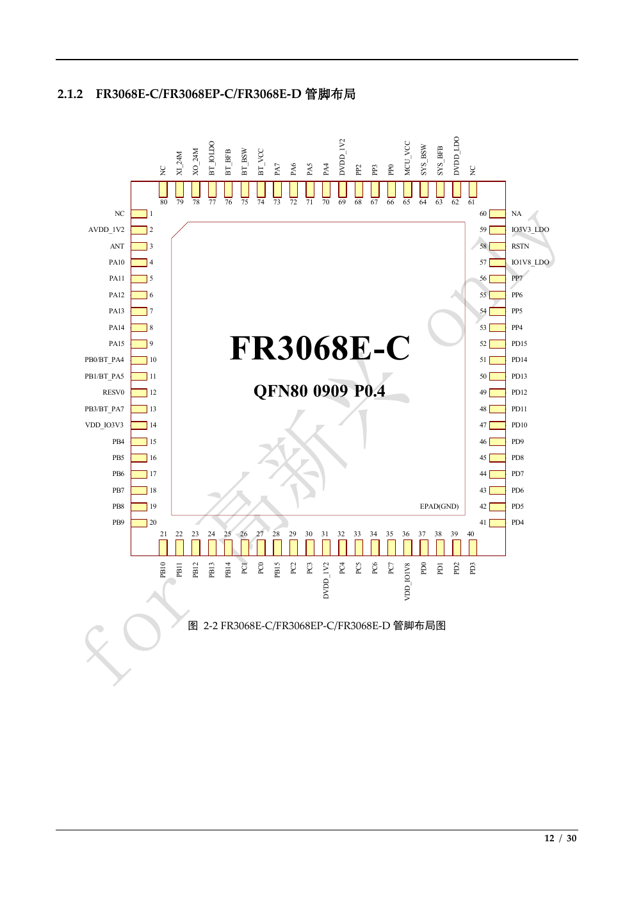
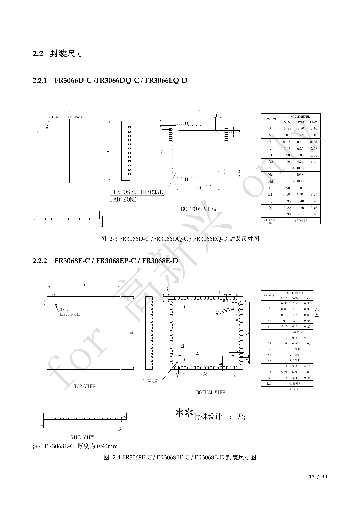

# FR306x 封裝、尺寸與完整 pin 表

來源：[PDF](../QT0013201514_FR306x技术规格书_v0.4.9.pdf) p.11-18，圖 2-1 至 2-4、表 2-1 至 2-3。返回 [索引](README.md)。本表是 physical pin 定義，不是 ET-100 net map，也沒有替 GPIO 指定 UART／CAN／SWD alternate function。

## 1. 類型及使用限制

| 來源類型 | 意義 |
|---|---|
| Analog | 類比管腳 |
| IO | 雙向數位介面 |
| PWR | 電源 |
| GND | 接地 |
| `-` | 表內未指定類型，不代表可以任意當 GPIO |

GPIO 在來源中的描述均為「多功能 GPIO」。`NC` 是未連接，`NA` 是未使用，`RESV0` 是保留管腳；來源未給外部 pull、NC 連接、RESV0 處置或容許電壓，不能自行制定處置。電源腳即使類型標 Analog，也不可配置成 GPIO。

圖 2-1／2-2 有 EPAD(GND)，pin 表沒有為 EPAD 編一個額外 pin number。PCB symbol／footprint 應明確處理 exposed pad 接地，不擅自推成 pin 49／81。

## 2. QFN48 全部 48 pin

適用：FR3066D-C、FR3066DQ-C、FR3066EQ-D。來源：圖 p.11；表 p.14-15。表中只有 RSTN 明示內置 10 kΩ pull-up。

| Pin | 名稱 | 類型 | 描述 |
|---|---|---|---|
| 1 | NC | - | 未連接 |
| 2 | ANT | Analog | Bluetooth 天線輸入／輸出 |
| 3 | PB0/BT_PA4 | IO | 多功能 GPIO |
| 4 | PB1/BT_PA5 | IO | 多功能 GPIO |
| 5 | RESV0 | - | 保留管腳 0 |
| 6 | PB3/BT_PA7 | IO | 多功能 GPIO |
| 7 | PB4 | IO | 多功能 GPIO |
| 8 | PB5 | IO | 多功能 GPIO |
| 9 | PB6 | IO | 多功能 GPIO |
| 10 | PB7 | IO | 多功能 GPIO |
| 11 | PB8 | IO | 多功能 GPIO |
| 12 | PB9 | IO | 多功能 GPIO |
| 13 | PB10 | IO | 多功能 GPIO |
| 14 | PB11 | IO | 多功能 GPIO |
| 15 | DVDD_1V2 | Analog | 數位 1.2 V 電源 |
| 16 | PD0 | IO | 多功能 GPIO |
| 17 | PD1 | IO | 多功能 GPIO |
| 18 | PD2 | IO | 多功能 GPIO |
| 19 | PD3 | IO | 多功能 GPIO |
| 20 | PD4 | IO | 多功能 GPIO |
| 21 | PD5 | IO | 多功能 GPIO |
| 22 | PD6 | IO | 多功能 GPIO |
| 23 | PD7 | IO | 多功能 GPIO |
| 24 | PD8 | IO | 多功能 GPIO |
| 25 | PD9 | IO | 多功能 GPIO |
| 26 | PD10 | IO | 多功能 GPIO |
| 27 | PD11 | IO | 多功能 GPIO |
| 28 | PP2/PA4 | IO | 多功能 GPIO |
| 29 | PP3/PA5 | IO | 多功能 GPIO |
| 30 | PP4/PD12 | IO | 多功能 GPIO |
| 31 | PP5/PD13 | IO | 多功能 GPIO |
| 32 | PP6/PD14 | IO | 多功能 GPIO |
| 33 | PP7/PD15 | IO | 多功能 GPIO |
| 34 | IO1V8_LDO | Analog | 1.8 V IO LDO |
| 35 | RSTN | Analog | 全域 reset，低有效，內建 10 kΩ pull-up |
| 36 | IO3V3_LDO | Analog | 3.3 V IO LDO |
| 37 | GND | GND | 接地 |
| 38 | DVDD_LDO | Analog | 數位 1.2 V LDO 輸出 |
| 39 | SYS_BFB | Analog | 系統 DC/DC feedback 輸入 |
| 40 | SYS_BSW | Analog | 系統 DC/DC 輸出 |
| 41 | MCU_VCC | PWR | MCU 供電 |
| 42 | BT_VCC | PWR | Bluetooth 供電 |
| 43 | BT_BSW | Analog | Bluetooth DC/DC 輸出 |
| 44 | BT_BFB | Analog | Bluetooth DC/DC feedback 輸入 |
| 45 | BT_IOLDO | Analog | Bluetooth IO LDO |
| 46 | XO_24M | Analog | 24 MHz 晶體輸出 |
| 47 | XI_24M | Analog | 24 MHz 晶體輸入 |
| 48 | NC | - | 未連接 |

## 3. QFN80 全部 80 pin

適用：FR3068E-C、FR3068EP-C、FR3068E-D。來源：圖 p.12；表 p.15-18。原節標題一處寫 `FR3608E-D`，視為來源文字疑點，型號依訂購表與表 2-3 標題記為 `FR3068E-D`。

| Pin | 名稱 | 類型 | 描述 |
|---|---|---|---|
| 1 | NC | - | 未連接 |
| 2 | AVDD_1V2 | Analog | 類比電路 1.2 V 電源 |
| 3 | ANT | Analog | Bluetooth 天線輸入／輸出 |
| 4 | PA10 | IO | 多功能 GPIO |
| 5 | PA11 | IO | 多功能 GPIO |
| 6 | PA12 | IO | 多功能 GPIO |
| 7 | PA13 | IO | 多功能 GPIO |
| 8 | PA14 | IO | 多功能 GPIO |
| 9 | PA15 | IO | 多功能 GPIO |
| 10 | PB0/BT_PA4 | IO | 多功能 GPIO |
| 11 | PB1/BT_PA5 | IO | 多功能 GPIO |
| 12 | RESV0 | - | 保留管腳 0 |
| 13 | PB3/BT_PA7 | IO | 多功能 GPIO |
| 14 | VDD_IO3V3 | Analog | 3.3 V IO 供電 |
| 15 | PB4 | IO | 多功能 GPIO |
| 16 | PB5 | IO | 多功能 GPIO |
| 17 | PB6 | IO | 多功能 GPIO |
| 18 | PB7 | IO | 多功能 GPIO |
| 19 | PB8 | IO | 多功能 GPIO |
| 20 | PB9 | IO | 多功能 GPIO |
| 21 | PB10 | IO | 多功能 GPIO |
| 22 | PB11 | IO | 多功能 GPIO |
| 23 | PB12 | IO | 多功能 GPIO |
| 24 | PB13 | IO | 多功能 GPIO |
| 25 | PB14 | IO | 多功能 GPIO |
| 26 | PC1 | IO | 多功能 GPIO |
| 27 | PC0 | IO | 多功能 GPIO |
| 28 | PB15 | IO | 多功能 GPIO |
| 29 | PC2 | IO | 多功能 GPIO |
| 30 | PC3 | IO | 多功能 GPIO |
| 31 | DVDD_1V2 | Analog | 數位 1.2 V 電源 |
| 32 | PC4 | IO | 多功能 GPIO |
| 33 | PC5 | IO | 多功能 GPIO |
| 34 | PC6 | IO | 多功能 GPIO |
| 35 | PC7 | IO | 多功能 GPIO |
| 36 | VDD_IO1V8 | Analog | 1.8 V IO 供電 |
| 37 | PD0 | IO | 多功能 GPIO |
| 38 | PD1 | IO | 多功能 GPIO |
| 39 | PD2 | IO | 多功能 GPIO |
| 40 | PD3 | IO | 多功能 GPIO |
| 41 | PD4 | IO | 多功能 GPIO |
| 42 | PD5 | IO | 多功能 GPIO |
| 43 | PD6 | IO | 多功能 GPIO |
| 44 | PD7 | IO | 多功能 GPIO |
| 45 | PD8 | IO | 多功能 GPIO |
| 46 | PD9 | IO | 多功能 GPIO |
| 47 | PD10 | IO | 多功能 GPIO |
| 48 | PD11 | IO | 多功能 GPIO |
| 49 | PD12 | IO | 多功能 GPIO |
| 50 | PD13 | IO | 多功能 GPIO |
| 51 | PD14 | IO | 多功能 GPIO |
| 52 | PD15 | IO | 多功能 GPIO |
| 53 | PP4 | IO | 多功能 GPIO |
| 54 | PP5 | IO | 多功能 GPIO |
| 55 | PP6 | IO | 多功能 GPIO |
| 56 | PP7 | IO | 多功能 GPIO |
| 57 | IO1V8_LDO | Analog | 1.8 V IO LDO |
| 58 | RSTN | Analog | 全域 reset，低有效，內建 10 kΩ pull-up |
| 59 | IO3V3_LDO | Analog | 3.3 V IO LDO |
| 60 | NA | - | 未使用 |
| 61 | NC | - | 未連接 |
| 62 | DVDD_LDO | Analog | 數位 1.2 V LDO 輸出 |
| 63 | SYS_BFB | Analog | 系統 DC/DC feedback 輸入 |
| 64 | SYS_BSW | Analog | 系統 DC/DC 輸出 |
| 65 | MCU_VCC | PWR | MCU 供電 |
| 66 | PP0 | IO | 多功能 GPIO |
| 67 | PP3 | IO | 多功能 GPIO |
| 68 | PP2 | IO | 多功能 GPIO |
| 69 | DVDD_1V2 | Analog | 數位 1.2 V 電源 |
| 70 | PA4 | IO | 多功能 GPIO |
| 71 | PA5 | IO | 多功能 GPIO |
| 72 | PA6 | IO | 多功能 GPIO |
| 73 | PA7 | IO | 多功能 GPIO |
| 74 | BT_VCC | PWR | Bluetooth 供電 |
| 75 | BT_BSW | Analog | Bluetooth DC/DC 輸出 |
| 76 | BT_BFB | Analog | Bluetooth DC/DC feedback 輸入 |
| 77 | BT_IOLDO | Analog | Bluetooth IO LDO |
| 78 | XO_24M | Analog | 24 MHz 晶體輸出 |
| 79 | XI_24M | Analog | 24 MHz 晶體輸入 |
| 80 | NC | - | 未連接 |

### 容易誤讀的 QFN80 pin

- p.12 圖與 p.16 表一致：pin 26 是 PC1，pin 27 是 PC0，不依數字大小重排。
- PB15 在 pin 28；PC2 在 pin 29。
- pin 31、69 是 DVDD_1V2，pin 36 才是 VDD_IO1V8。
- pin 13 是 PB3/BT_PA7，pin 14 才是 VDD_IO3V3。
- pin 53-56 是 PP4-PP7；pin 52 是 PD15。
- 來源名稱 `BT_PA5` 不要改成舊筆記的 `BT_PA7`。
- 來源沒有逐 pin IO voltage-domain 表，也未標 SWCLK／SWDIO 功能；不可把舊筆記的分域或 debug pin 直接當成本表事實。

## 4. QFN48 機械尺寸

來源 p.13，圖 2-3；單位 mm，除表中另註。尺寸依原圖逐列核對，原文字層未抽出 L／K／h 標籤，因此以圖像補正。

| Symbol | Min | Nom | Max | 意義／原圖註記 |
|---|---|---|---|---|
| A | 0.85 | 0.90 | 0.95 | 總厚度 |
| A1 | 0 | 0.02 | 0.05 | 底部間距 |
| b | 0.15 | 0.20 | 0.25 | lead 寬度 |
| c | 0.18 | 0.20 | 0.23 | 原圖尺寸 c |
| D | 5.90 | 6.00 | 6.10 | 外形 D |
| D2 | 4.10 | 4.20 | 4.30 | exposed pad D2 |
| e | — | 0.40 BSC | — | pitch |
| Ne | — | 4.40 BSC | — | 原圖 Ne |
| Nd | — | 4.40 BSC | — | 原圖 Nd |
| E | 5.90 | 6.00 | 6.10 | 外形 E |
| E2 | 4.10 | 4.20 | 4.30 | exposed pad E2 |
| L | 0.35 | 0.40 | 0.45 | 原圖 L |
| K | 0.20 | 0.50 | 0.55 | 原圖 K，保留來源數值 |
| h | 0.30 | 0.35 | 0.40 | 原圖 h |
| L/F 鐵框尺寸 | — | 177 × 177 | — | 原圖單位 MIL，不是 mm |

## 5. QFN80 機械尺寸

來源 p.13，圖 2-4；單位 mm。圖中 A 有三個厚度選項，沒有完整解釋選項如何對應各料號；圖下明示 FR3068E-C 厚度為 0.90 mm。

| Symbol | Min | Nom | Max | 意義／原圖註記 |
|---|---|---|---|---|
| A，第一列 | 0.80 | 0.85 | 0.90 | 厚度選項，不能自行對應料號 |
| A，第二列 | 0.85 | 0.90 | 0.95 | 圖旁三角標示 1 |
| A，第三列 | 0.70 | 0.75 | 0.80 | 圖旁三角標示 2 |
| A1 | 0 | 0.02 | 0.05 | 底部間距 |
| b | 0.15 | 0.20 | 0.25 | lead 寬度 |
| c | — | 0.203 REF | — | 原圖 c |
| D | 8.90 | 9.00 | 9.10 | 外形 D |
| D2 | 6.80 | 6.90 | 7.00 | exposed pad D2 |
| e | — | 0.40 BSC | — | pitch |
| Nd | — | 7.60 BSC | — | 原圖 Nd |
| Ne | — | 7.60 BSC | — | 原圖 Ne |
| E | 8.90 | 9.00 | 9.10 | 外形 E |
| E2 | 6.80 | 6.90 | 7.00 | exposed pad E2 |
| L | 0.35 | 0.40 | 0.45 | 原圖 L |
| L1 | — | 0.39 REF | — | 原圖 L1 |
| k | — | 0.65 REF | — | 原圖 k |

原圖另標：Pin 1 雷射標記、TOP／BOTTOM／SIDE VIEW、EXPOSED THERMAL PAD ZONE、`R0.20 REF`、局部 `0.10` 與 `0.45` 尺寸，特殊設計「無」。這些局部標註的幾何位置須看圖，不當成可單獨套用的 pad 設計值。

`BSC` 是 basic dimension、`REF` 是 reference dimension；上述解釋是工程記號說明，非原文新增公差。封裝尺寸不是 PCB recommended land pattern，文件沒有 reflow profile、stencil、thermal via、solder-mask 或 recommended footprint。

## 6. 供電／reset 快查（FR3068E-C）

| 功能 | Physical pin | 原廠名稱 |
|---|---|---|
| 主核輸入供電 | 65 | MCU_VCC |
| Bluetooth 輸入供電 | 74 | BT_VCC |
| 3.3 V IO 供電 | 14 | VDD_IO3V3 |
| 1.8 V IO 供電 | 36 | VDD_IO1V8 |
| IO LDO | 57、59 | IO1V8_LDO、IO3V3_LDO |
| 數位 1.2 V | 31、69；62 | DVDD_1V2；DVDD_LDO output |
| 類比 1.2 V | 2 | AVDD_1V2 |
| 系統 Buck | 63、64 | SYS_BFB feedback、SYS_BSW output |
| Bluetooth Buck／LDO | 75、76、77 | BT_BSW output、BT_BFB feedback、BT_IOLDO |
| Reset | 58 | RSTN，低有效，10 kΩ pull-up |
| 晶體 | 78、79 | XO_24M output、XI_24M input |
| 天線 | 3 | ANT |
| 地 | EPAD | EPAD(GND)，未給額外編號 |

外接電容、AVDD／DVDD 如何供電、能否由外部 bypass LDO、供電相依與各域 sequencing 必須另取 hardware design guide，不能只依本表連接。
