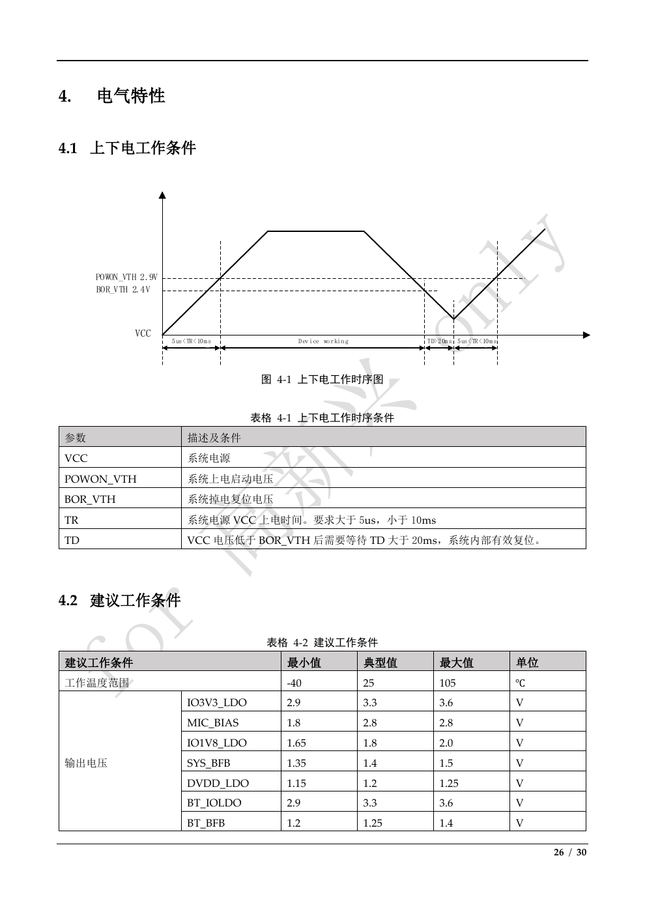

# FR306x 電氣、電源、IO、時鐘與 ESD

來源：[PDF](../QT0013201514_FR306x技术规格书_v0.4.9.pdf) p.5、10、26-28，表 4-1 至 4-8。返回 [索引](README.md)。以下工作電壓不是 absolute maximum ratings；原文件沒有完整絕對最大額定值表。

## 1. 上下電條件

來源 p.26，圖 4-1／表 4-1。

| 參數 | 來源定義 | 數值／條件 |
|---|---|---|
| VCC | 系統電源 | 圖中被量測的 supply waveform |
| POWON_VTH | 上電啟動電壓 | 2.9 V，來自圖中標註 |
| BOR_VTH | 掉電 reset 電壓 | 2.4 V，來自圖中標註 |
| TR | VCC 上電時間 | **大於 5 us、小於 10 ms**，嚴格不等式 |
| TD | VCC 低於 BOR_VTH 後等待時間 | **大於 20 ms**，讓內部有效 reset |

圖的 TD 标示為 `TD > 20 ms`；不要寫成「至少 20 ms 即保證有效」。來源未提供 threshold tolerance、hysteresis、分域時序、RSTN minimum pulse width、reset propagation 或 slow-ramp 行為。

### 開發推導與量測項目（非原廠新增規格）

- 在 MCU_VCC／BT_VCC 實際 pin 量測冷開機、快速電源循環、供電瞬降；不能只測上游 regulator 輸出。
- 保持工作電壓在 recommended range，不把 2.4 V BOR 門檻當成可運作的最低電壓。
- 外部電源循環應確保供電確實低於 BOR 門檻並維持足夠 TD；僅拉 RSTN 與整機斷電不是同一測試。
- 原文沒有 MCU_VCC 與 BT_VCC 是否可分開上電、1.8 V／3.3 V IO 順序、unpowered IO injection 的規格，需原廠回答。

## 2. Recommended operating conditions 全表

來源 p.26-27，表 4-2。`—` 是未提供。

| 類別 | 項目 | Min | Typ | Max | 單位 |
|---|---|---|---|---|---|
| 環境 | 工作溫度 | -40 | 25 | 105 | °C |
| 輸出電壓 | IO3V3_LDO | 2.9 | 3.3 | 3.6 | V |
| 輸出電壓 | MIC_BIAS | 1.8 | 2.8 | 2.8 | V |
| 輸出電壓 | IO1V8_LDO | 1.65 | 1.8 | 2.0 | V |
| 輸出電壓 | SYS_BFB | 1.35 | 1.4 | 1.5 | V |
| 輸出電壓 | DVDD_LDO | 1.15 | 1.2 | 1.25 | V |
| 輸出電壓 | BT_IOLDO | 2.9 | 3.3 | 3.6 | V |
| 輸出電壓 | BT_BFB | 1.2 | 1.25 | 1.4 | V |
| 輸入供電 | MCU_VCC | 2.9 | 3.3 | 3.6 | V |
| 輸入供電 | BT_VCC | 2.9 | 3.3 | 3.6 | V |

注意：SYS_BFB／BT_BFB 在 pin 表是 feedback input，但電壓表被放在「輸出電壓」欄下，依原文保留；不可因這個分類就把 feedback pin 當電源輸出帶負載。MIC_BIAS 有列電壓，但 pin 表沒有對應 MIC_BIAS pin，是否適用此料號待確認。VDD_IO3V3／VDD_IO1V8 獨立的 recommended input range 沒有在此表列出，不直接用 LDO output range 代替。

## 3. 詳細功耗表

來源 p.27，表 4-3。這張表的欄位是「平均值／最大值」，不是 Typ／Max。

| 模式 | 平均值 | 最大值 | 單位 | 原文條件 |
|---|---|---|---|---|
| TX 峰值，0 dBm | — | 18.2 | mA | 原表未再列 supply／temperature |
| RX 峰值 | — | 9.8 | mA | 原表未再列 supply／temperature |
| Deep sleep，include 128K retention RAM | TBD | — | uA | 保留 128K RAM |
| Power-off mode | TBD | — | µA | 無數字 |

Deep sleep 128K retention、power off 仍是 TBD，不能以 p.5 的 32／64 KB retention 數字取代。

## 4. 首頁低功耗摘要（與詳細表分開）

來源 p.5：該段標示條件 **Buck mode，3.3 V，25 °C**。

| 項目 | 原文數值 | 條件／限制 |
|---|---|---|
| MC1(CM33) typical current | `< 9 mA @ 96 MHz (<50 uA/MHz)` | 保留整句；兩個上限不是同一數值換算 |
| Bluetooth RX typical current | 9.8 mA | Buck，3.3 V；段落總條件 25 °C |
| Bluetooth TX typical current | 18.2 mA | 0 dBm，Buck，3.3 V |
| Sleep，RTC 開啟、任意 GPIO wake | 8.9 uA | 64 KB SRAM retention |
| Sleep，RTC 開啟、任意 GPIO wake | 7.2 uA | 32 KB SRAM retention |
| BLE advertising average | 28.8 uA | 1 s advertising interval，0 dBm |
| BLE connected average | 20.5 uA | 1 s connection interval，0 dBm |

來源 p.5 將 9.8／18.2 mA 寫成典型電流，p.27 卻將相同數字放在最大值欄；不可在功耗 budget 中悄悄統一成同一種保證。`50 uA/MHz × 96 MHz = 4.8 mA` 是算術推導，來源另外寫 `<9 mA`，未交代 workload 或 clock／memory 條件差異。

這些是晶片／Bluetooth 模式摘要，不是整個 ET-100 的待機或工作電流；LTE、GNSS、外部 Flash、NFC、transceiver、pull-up 和 regulator 的消耗需另計。

## 5. IO 邏輯門檻完整表

來源 p.27，表 4-4；測試條件均為 IO = 3.3 V 或 IO = 1.8 V。

| 符號 | 意義 | Min | Typ | Max | 單位 |
|---|---|---|---|---|---|
| VIL | 低電位輸入 | -0.3 | — | 0.3 × IO | V |
| VIH | 高電位輸入 | 0.7 × IO | — | IO + 0.2 | V |
| VOL | 低電位輸出 | — | — | 0.3 | V |
| VOH | 高電位輸出 | 0.7 × IO | — | — | V |

### 依公式計算的門檻（非另一組量測值）

| IO 電壓 | VIL 上限 | VIH 下限 | VIH 表列上限 | VOH 下限 | VOL 上限 |
|---|---|---|---|---|---|
| 1.8 V | 0.54 V | 1.26 V | 2.0 V | 1.26 V | 0.3 V |
| 3.3 V | 0.99 V | 2.31 V | 3.5 V | 2.31 V | 0.3 V |

1.8 V 高電位不滿足 3.3 V GPIO 的 VIH 下限。此表並未宣稱 5 V tolerant、也沒有指定 VOH／VOL 對應負載電流、leakage 或 pin injection limit；驅動設定 16 mA 不等於在該負載下已提供 VOH 保證。

## 6. IO pull 與 drive

來源 p.27，表 4-5；原表沒有 Min／Typ／Max 或公差。

| IO 類別 | Pull-up | Pull-down | Drive capability |
|---|---|---|---|
| PORT_PMU(ADC) | 16 kΩ | 16 kΩ | 16 mA |
| GPIO，1.8 V | 12.5 kΩ | 10 kΩ | 可配置 4／8／12／16 mA |
| GPIO，3.3 V | 10 kΩ | 10 kΩ | 可配置 4／8／12／16 mA |

RSTN 的 10 kΩ 內建 pull-up 另見 p.15／17 pin 表。這些 pull 值不表示所有 pin 的 reset default 均啟用 pull，也不取代 I2C 外部 pull-up 計算。

## 7. 晶體相關參數

來源 p.28，表 4-6。原 pin 是 XI_24M／XO_24M，這是晶體相關表，不能直接當成外部 TCXO bypass 接法規格。

| 參數 | Min | Typ | Max | 單位 |
|---|---|---|---|---|
| 頻率 | 24 | 24 | 24 | MHz |
| CL load capacitance | — | 9 | 12 | pF |
| 公差 | — | ±10 | — | PPM |
| ESR | — | — | 60 | Ω |
| Parasitic capacitance | — | — | 2 | pF |

來源沒有說 ±10 ppm 是 initial tolerance、temperature stability 或 aging 合計；沒有 startup time、XI waveform／amplitude、TCXO input mode 或 bypass 寄存器。

工程推導：對一般兩端晶體，常見估算是 `CL ≈ C1*C2/(C1+C2) + Cstray`；這不是來源規定，不可直接把 CL=9 pF 翻成 C1=C2=9 pF。需依晶體、layout、內部電容及原廠指南調整。

## 8. Buck 電感完整規格

來源 p.28，表 4-7。

| Buck | 電感 | 飽和電流 | Self-resonant frequency | DCR |
|---|---|---|---|---|
| BT_Buck | 10 µH | ≥80 mA | ≥10 MHz | ≤1 Ω |
| SYS_Buck | 2.2 µH | ≥300 mA | ≥10 MHz | ≤1 Ω |

來源沒有電感容差、ripple current、switch frequency、效率曲線、輸出電容／ESR 或 layout loop 建議。BT 與 SYS 的電感值不可互換；確認原理圖前不能僅依舊筆記的 2.2 µH filter 描述選料。

## 9. ESD

來源 p.28，新增 §4.8／表 4-8（目錄未列此節，修訂表指出 v0.4.9 增加 ESD）。

| 模式 | 數值 | 單位 |
|---|---|---|
| HBM | ±2000 | V |
| CDM | ±500 | V |

這是元件 ESD 模型，來源未列測試標準版本、pin 組合、pass criterion。不能解讀成整機 IEC 61000-4-2 接觸／空氣放電等級，更不能據此移除 connector TVS。

## 10. 實作前仍缺的電氣資料

Absolute maximum、每 pin／每 port／整顆總電流、unpowered IO、反灌、ADC input range／reference、reset pulse、各 rail sequencing、LDO load capability、decoupling、Flash write 電壓限制、clock accuracy 合計 budget 均未給。開發追問與量測清單見 [05](05_et100_development_reference.md)／[06](06_gaps_and_revision_history.md)。
