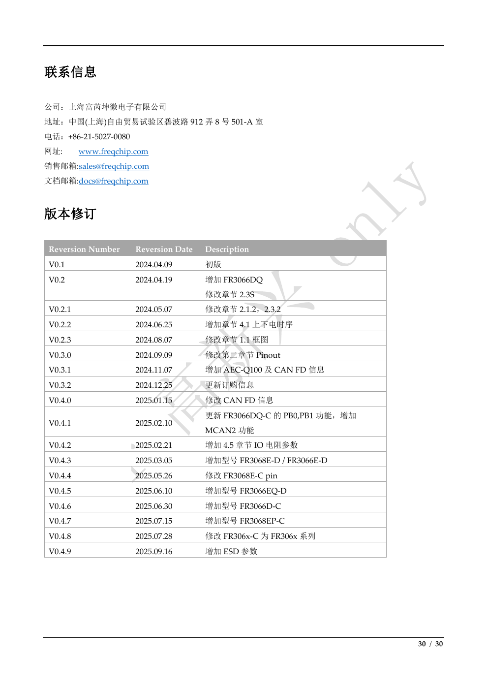

# FR306x 來源歧義、開發缺口、縮寫與版本歷史

來源：[PDF](../QT0013201514_FR306x技术规格书_v0.4.9.pdf)，頁次逐項列出。返回 [索引](README.md)。此文件避免把來源不一致的內容整理成看似確定的單一答案。

## 1. 原文件內部歧義／不完整資訊

| ID | 頁次 | 原文情況 | 整理與開發處置 |
|---|---|---|---|
| D01 | p.5、7 | 概述稱符合 AEC-Q100 Grade 2，訂購表只有 DQ-C／EQ-D 為「是」 | 資格分料號判讀，FR3068E-C 欄為「否」 |
| D02 | p.5、8 | 摘要最多 31×PWM，圖為 2×PWM／16 channels | 保留兩種寫法，不自行得出 31／32 路都可外接 |
| D03 | p.5、8 | 最多 4-ch PDM，圖為 PDM×2 | instance 與 channel 是否不同層次需確認 |
| D04 | p.5、8-9 | SPI 摘要和 OSPIM／SPIM／SPIS／QSPIS 圖列方式不同 | 不相加為額外独立控制器，需 reference manual |
| D05 | p.5 | MC1 `<9 mA @96MHz (<50uA/MHz)` | 兩個上限非單純換算；50×96=4.8 mA，需 workload／條件 |
| D06 | p.5、27 | 18.2／9.8 mA 在摘要為典型，在功耗表為最大欄 | 分開保留，不自行統一為 Typ 或 Max |
| D07 | p.5、27 | 32／64 KB sleep retention 有數字，128K deep sleep 為 TBD | 不能套用已知數字補上 TBD |
| D08 | p.5 | ADC 列 FR3068 型號 9ch、DQ-C／EQ-D 7ch | 未明示 FR3066D-C 的 ADC channel 數 |
| D09 | p.8 | 方塊圖題為 FR306x-C、CAN×4 | 系列图不代表各型號資源，依 p.7 分別核對 |
| D10 | p.15 | §2.3.2 標題一處 FR3608E-D | 表標題、訂購表為 FR3068E-D；保留 typo 記錄 |
| D11 | p.23 | BLE S2 -100.5 靈敏度單位為 dB | p.5／9 為 dBm，疑似單位筆誤，不隱藏 |
| D12 | p.26、pin 表 | SYS_BFB／BT_BFB 表列「輸出電壓」，pin 表為 feedback input | 電壓分類不代表可由該 pin 帶負載 |
| D13 | p.26、pin 表 | MIC_BIAS 有 voltage row，但無對應 pin | 適用型號／內部信號／舊表遺留需確認 |
| D14 | p.13 | QFN80 A 有三列厚度，△1／△2 未解釋；註 FR3068E-C 厚 0.90mm | 保留全部選項，不能自行配到 E-D／EP-C |
| D15 | p.2-3、28 | 目錄／表格索引止於 §4.7／表4-7，正文有 §4.8／表4-8 ESD | 整理仍完整包含 ESD |
| D16 | p.30 | v0.2 修改章节寫 `2.3S` | 保留原文，不猜 S 是否應刪 |
| D17 | p.30、7 | v0.4.3 列 FR3066E-D，但現訂購表沒有該名字 | 不把它視為仍可訂購的第七型號 |
| D18 | p.30 | v0.4.4 修改 FR3068E-C pin | 不能把 v0.4.9 pin 表無条件套到舊 silicon／symbol |
| D19 | p.1、30、metadata | 封面 2025.09、修訂 2025.09.16、PDF metadata 2025.10.21 | 分別記錄，不判定檔案偽造或版本不同 |

## 2. 這份技術規格書未提供的開發規格

| 類別 | 缺少的具體資訊 | 適合取得的文件 |
|---|---|---|
| CPU／system | register map、interrupt map、TrustZone／MPU、reset defaults、clock tree／PLL limits | MCU reference manual／BSP guide |
| Memory | 完整 Flash／SRAM／PRAM bank map、retention、cache coherency、erase size／endurance、memory protection | Memory／Flash application notes |
| GPIO | 全 alternate-function matrix、1.8V／3.3V bank 對應、wake source matrix、unpowered behavior | Pinmux／IO design guide |
| Debug | SWCLK／SWDIO physical assignment、VTref、attach／erase／unlock、debug authentication | Programming／debug guide |
| Boot／OTA | ROM boot、boot header layout、CRC 算法／區域、family selector、A/B slot、recovery、secure boot | Bootloader／download／OTA guide |
| 電氣 | absolute maximum、IO leakage／injection、VOH／VOL load、reset pulse、domain sequencing、decoupling | Hardware design guide |
| Power | 各 clock／workload 電流、128K sleep／power-off 數字、wake latency、regulator efficiency | Power profiling application notes |
| ADC | range／reference、ENOB／accuracy、INL／DNL、sample impedance／time、scan／DMA、temperature sensor | ADC reference manual |
| CAN | 最大 nominal／data rates、bit timing、message RAM topology、clock tolerance、TDC、filters register | CAN controller reference manual |
| Serial／DMA | UART baud limits、I2C speed／slave capability、SPI mode／dummy cycle、DMA request matrix | Peripheral reference manual |
| USB／SD／Audio | pinmux、clocking、PHY／power、supported speeds、audio frame formats | Interface guide |
| Bluetooth | connection／MTU／buffer 最大值、profile／license、qualification、security defaults | Bluetooth SDK manual |
| Mechanical／qualification | land pattern、solder／reflow、thermal resistance、AEC 證書／package variant 對應 | Package drawing／qualification report |

這些缺口不能用常見 Cortex-M MCU 的慣例補成 FR306x 規格。可提出設計假設，但必須標示假設、來源與验证方式。

## 3. 原文件縮寫表

來源 p.29，全部五筆。

| 縮寫 | 原文意義（繁體整理） |
|---|---|
| AGC | 自動增益控制 |
| ADC | 類比數位轉換器 |
| GPIO | 通用輸入／輸出 |
| PMU | 電源管理單元 |
| OSC | 晶體振盪器 |

其他技術縮寫的補充說明：BR／EDR／BLE 是 Bluetooth 模式；SAR 是 successive approximation register；PDM／I2S 為音訊介面；ESR 為 equivalent series resistance；DCR 為 DC resistance；HBM／CDM 為元件 ESD 模型；MSL 為 moisture sensitivity level。這段是閱讀輔助，非 p.29 原表。

## 4. 原廠聯絡資訊（來源 p.30）

- 公司：上海富芮坤微電子有限公司。
- 地址：中國（上海）自由貿易試驗區碧波路 912 弄 8 號 501-A 室。
- 電話：+86-21-5027-0080。
- 網站原文：`www.freqchip.com`。
- 銷售：`sales@freqchip.com`。
- 文件：`docs@freqchip.com`。

以上是此 PDF 版本記載的資訊，本次未做網路查證，沒有發送 email 或聯絡原廠。

## 5. 完整修訂歷史

來源 p.30；日期與型號依原表，敘述轉為繁體。表頭原文為 `Reversion Number / Reversion Date / Description`。

| 版本 | 日期 | 變更 |
|---|---|---|
| V0.1 | 2024.04.09 | 初版 |
| V0.2 | 2024.04.19 | 增加 FR3066DQ；修改章節 `2.3S`（保留原文） |
| V0.2.1 | 2024.05.07 | 修改 §2.1.2、§2.3.2 |
| V0.2.2 | 2024.06.25 | 增加 §4.1 上下電時序 |
| V0.2.3 | 2024.08.07 | 修改 §1.1 方塊圖 |
| V0.3.0 | 2024.09.09 | 修改第二章 Pinout |
| V0.3.1 | 2024.11.07 | 增加 AEC-Q100 及 CAN FD 資訊 |
| V0.3.2 | 2024.12.25 | 更新訂購資訊 |
| V0.4.0 | 2025.01.15 | 修改 CAN FD 資訊 |
| V0.4.1 | 2025.02.10 | 更新 FR3066DQ-C 的 PB0、PB1 功能，增加 MCAN2 功能 |
| V0.4.2 | 2025.02.21 | 增加 §4.5 IO 電阻參數 |
| V0.4.3 | 2025.03.05 | 增加 FR3068E-D／FR3066E-D（保留歷史原名） |
| V0.4.4 | 2025.05.26 | 修改 FR3068E-C pin |
| V0.4.5 | 2025.06.10 | 增加 FR3066EQ-D |
| V0.4.6 | 2025.06.30 | 增加 FR3066D-C |
| V0.4.7 | 2025.07.15 | 增加 FR3068EP-C |
| V0.4.8 | 2025.07.28 | 修改 FR306x-C 為 FR306x 系列 |
| V0.4.9 | 2025.09.16 | 增加 ESD 參數 |

## 6. 整理驗證範圍

- 全 30 頁文字層抽取，並檢視全頁 render 總覽。
- 訂購表、QFN80 pin 圖、封裝尺寸及上電時序另做放大視覺核對。
- QFN48 48 pin、QFN80 80 pin 在 Markdown 各自完整且連續。
- 保留全部 13 張表（2-1／2-2／2-3、3-1／3-2、4-1 至4-8）與 6 幅圖的來源追溯。
- 逐頁全文與 PNG 提供二次查核；圖中局部尺寸不得僅依文字抽取解讀。
- ET-100 對照只查閱現有 SDK／舊筆記，未重新編譯、未修改 firmware、未確認實際板上晶片。

未宣稱任何新增資料已經實機驗證。pin-change 原因、記憶體 bank 分配與 exact-part 車規資格仍需原廠／實板證據。
