# FR306x v0.4.9 逐頁全文與原圖

来源：[原始 PDF](../QT0013201514_FR306x技术规格书_v0.4.9.pdf)。返回 [開發參考索引](README.md)。

本附錄由 Poppler `pdftotext -layout` 機械抽取，逐頁保留原簡體文字、英文字母、空白欄位與表格位置，不視為已修正的規格。圖片、旋轉文字、符號、合併欄位或小字可能無法完整反映於文字層；每頁 PNG 與原 PDF 是必要的圖形查核依據。經人工重編的表格與繁體說明見 01-06。

PDF SHA-256：`f61c99679aace3c2dd314870f0c021f83b6d2ad8a412805b4c0473daa8df13dd`。

## 頁面索引

- [PDF 第 01 頁：封面](#pdf-page-01)
- [PDF 第 02 頁：目錄](#pdf-page-02)
- [PDF 第 03 頁：表格索引](#pdf-page-03)
- [PDF 第 04 頁：插圖索引](#pdf-page-04)
- [PDF 第 05 頁：概述與特性](#pdf-page-05)
- [PDF 第 06 頁：應用領域](#pdf-page-06)
- [PDF 第 07 頁：訂購資訊](#pdf-page-07)
- [PDF 第 08 頁：功能方塊圖與收發器](#pdf-page-08)
- [PDF 第 09 頁：Bluetooth／CAN 控制器及介面](#pdf-page-09)
- [PDF 第 10 頁：介面續頁、PMU 與封裝](#pdf-page-10)
- [PDF 第 11 頁：QFN48 pin 圖](#pdf-page-11)
- [PDF 第 12 頁：QFN80 pin 圖](#pdf-page-12)
- [PDF 第 13 頁：封裝尺寸](#pdf-page-13)
- [PDF 第 14 頁：pin 類型與 QFN48 pin 1-21](#pdf-page-14)
- [PDF 第 15 頁：QFN48 pin 22-48／QFN80 pin 1](#pdf-page-15)
- [PDF 第 16 頁：QFN80 pin 2-36](#pdf-page-16)
- [PDF 第 17 頁：QFN80 pin 37-71](#pdf-page-17)
- [PDF 第 18 頁：QFN80 pin 72-80](#pdf-page-18)
- [PDF 第 19 頁：RF 範圍與 BR](#pdf-page-19)
- [PDF 第 20 頁：BR 發射／EDR 接收](#pdf-page-20)
- [PDF 第 21 頁：EDR 接收／發射](#pdf-page-21)
- [PDF 第 22 頁：EDR 調變／BLE 1M／2M](#pdf-page-22)
- [PDF 第 23 頁：BLE 2M／500 kbps](#pdf-page-23)
- [PDF 第 24 頁：BLE 500／125 kbps](#pdf-page-24)
- [PDF 第 25 頁：BLE 125 kbps 續頁](#pdf-page-25)
- [PDF 第 26 頁：上下電條件與工作電壓](#pdf-page-26)
- [PDF 第 27 頁：供電、電流、IO](#pdf-page-27)
- [PDF 第 28 頁：時鐘、Buck 與 ESD](#pdf-page-28)
- [PDF 第 29 頁：縮寫](#pdf-page-29)
- [PDF 第 30 頁：原廠聯絡與版本歷史](#pdf-page-30)

<a id="pdf-page-01"></a>

## PDF 第 01 頁：封面

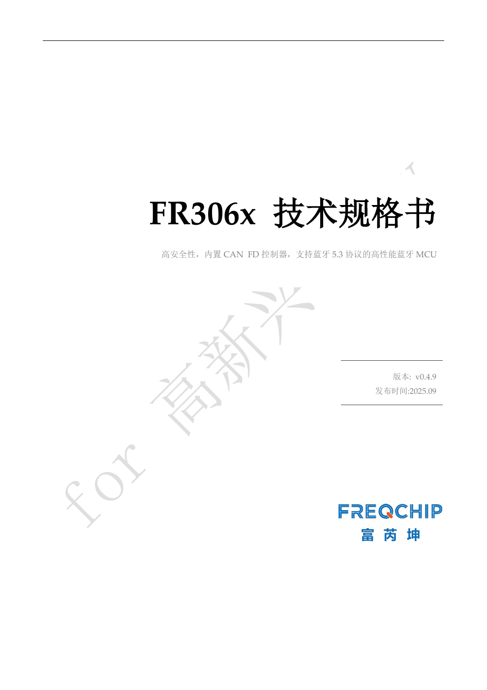

### 原始文字層

```text
FR306x 技术规格书
高安全性，内置 CAN FD 控制器，支持蓝牙 5.3 协议的高性能蓝牙 MCU


                                  版本: v0.4.9
                               发布时间:2025.09
```

<a id="pdf-page-02"></a>

## PDF 第 02 頁：目錄

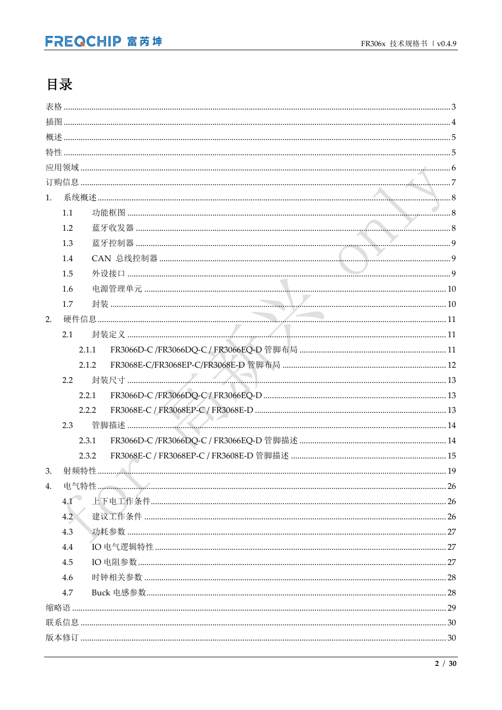

### 原始文字層

```text
                                                                                                                                               FR306x 技术规格书 | v0.4.9


目录
表格 ...................................................................................................................................................................................... 3
插图 ...................................................................................................................................................................................... 4
概述 ...................................................................................................................................................................................... 5
特性 ...................................................................................................................................................................................... 5
应用领域 .............................................................................................................................................................................. 6
订购信息 .............................................................................................................................................................................. 7
1.      系统概述 ...................................................................................................................................................................... 8
       1.1           功能框图 ........................................................................................................................................................ 8
       1.2           蓝牙收发器 .................................................................................................................................................... 8
       1.3           蓝牙控制器 .................................................................................................................................................... 9
       1.4           CAN 总线控制器 ......................................................................................................................................... 9
       1.5           外设接口 ........................................................................................................................................................ 9
       1.6           电源管理单元 .............................................................................................................................................. 10
       1.7           封装 .............................................................................................................................................................. 10
2.      硬件信息 .................................................................................................................................................................... 11
       2.1           封装定义 ...................................................................................................................................................... 11
               2.1.1         FR3066D-C /FR3066DQ-C / FR3066EQ-D 管脚布局 ..................................................................... 11
               2.1.2         FR3068E-C/FR3068EP-C/FR3068E-D 管脚布局 ............................................................................. 12
       2.2           封装尺寸 ...................................................................................................................................................... 13
               2.2.1         FR3066D-C /FR3066DQ-C / FR3066EQ-D ...................................................................................... 13
               2.2.2         FR3068E-C / FR3068EP-C / FR3068E-D .......................................................................................... 13
       2.3           管脚描述 ...................................................................................................................................................... 14
               2.3.1         FR3066D-C /FR3066DQ-C / FR3066EQ-D 管脚描述 ..................................................................... 14
               2.3.2         FR3068E-C / FR3068EP-C / FR3608E-D 管脚描述 ......................................................................... 15
3.      射频特性 .................................................................................................................................................................... 19
4.      电气特性 .................................................................................................................................................................... 26
       4.1           上下电工作条件........................................................................................................................................... 26
       4.2           建议工作条件 .............................................................................................................................................. 26
       4.3           功耗参数 ...................................................................................................................................................... 27
       4.4           IO 电气逻辑特性 ......................................................................................................................................... 27
       4.5           IO 电阻参数 ................................................................................................................................................. 27
       4.6           时钟相关参数 .............................................................................................................................................. 28
       4.7           Buck 电感参数 ............................................................................................................................................. 28
缩略语 ................................................................................................................................................................................ 29
联系信息 ............................................................................................................................................................................ 30
版本修订 ............................................................................................................................................................................ 30

                                                                                                                                                                                 2 / 30
```

<a id="pdf-page-03"></a>

## PDF 第 03 頁：表格索引

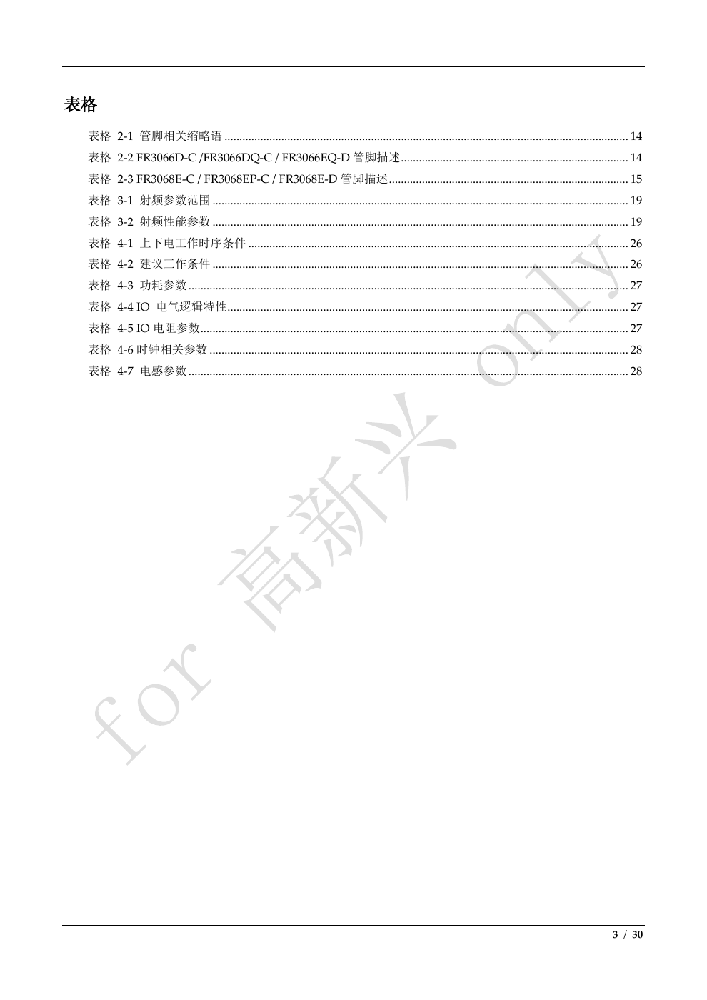

### 原始文字層

```text
表格
 表格 2-1 管脚相关缩略语 ....................................................................................................................................... 14
 表格 2-2 FR3066D-C /FR3066DQ-C / FR3066EQ-D 管脚描述 ............................................................................ 14
 表格 2-3 FR3068E-C / FR3068EP-C / FR3068E-D 管脚描述 ................................................................................ 15
 表格 3-1 射频参数范围 ........................................................................................................................................... 19
 表格 3-2 射频性能参数 ........................................................................................................................................... 19
 表格 4-1 上下电工作时序条件 ............................................................................................................................... 26
 表格 4-2 建议工作条件 ........................................................................................................................................... 26
 表格 4-3 功耗参数 ................................................................................................................................................... 27
 表格 4-4 IO 电气逻辑特性 ...................................................................................................................................... 27
 表格 4-5 IO 电阻参数 ............................................................................................................................................... 27
 表格 4-6 时钟相关参数 ............................................................................................................................................ 28
 表格 4-7 电感参数 ................................................................................................................................................... 28


                                                                                                                                                          3 / 30
```

<a id="pdf-page-04"></a>

## PDF 第 04 頁：插圖索引

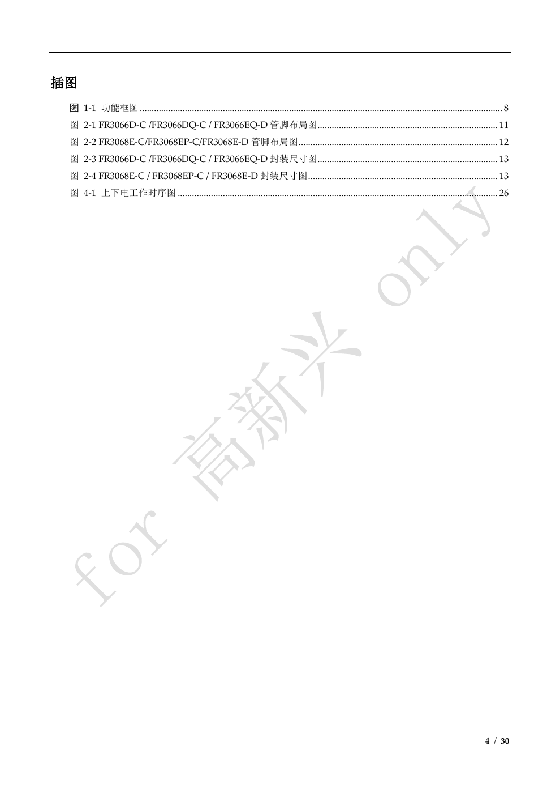

### 原始文字層

```text
插图
 图 1-1 功能框图 ......................................................................................................................................................... 8
 图 2-1 FR3066D-C /FR3066DQ-C / FR3066EQ-D 管脚布局图 ............................................................................ 11
 图 2-2 FR3068E-C/FR3068EP-C/FR3068E-D 管脚布局图 .................................................................................... 12
 图 2-3 FR3066D-C /FR3066DQ-C / FR3066EQ-D 封装尺寸图 ............................................................................ 13
 图 2-4 FR3068E-C / FR3068EP-C / FR3068E-D 封装尺寸图 ................................................................................ 13
 图 4-1 上下电工作时序图 ....................................................................................................................................... 26


                                                                                                                                                              4 / 30
```

<a id="pdf-page-05"></a>

## PDF 第 05 頁：概述與特性

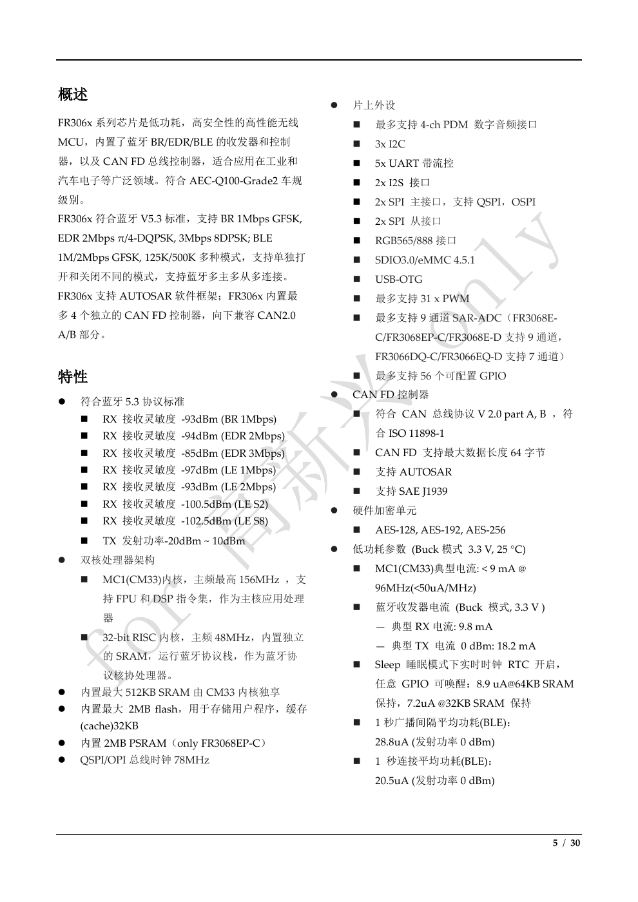

### 原始文字層

```text
概述
                                           片上外设
FR306x 系列芯片是低功耗，高安全性的高性能无线                     最多支持 4-ch PDM 数字音频接口
MCU，内置了蓝牙 BR/EDR/BLE 的收发器和控制                   3x I2C
器，以及 CAN FD 总线控制器，适合应用在工业和                     5x UART 带流控
汽车电子等广泛领域。符合 AEC-Q100-Grade2 车规                2x I2S 接口
级别。                                            2x SPI 主接口，支持 QSPI，OSPI
FR306x 符合蓝牙 V5.3 标准，支持 BR 1Mbps GFSK,          2x SPI 从接口
EDR 2Mbps π/4-DQPSK, 3Mbps 8DPSK; BLE          RGB565/888 接口
1M/2Mbps GFSK, 125K/500K 多种模式，支持单独打            SDIO3.0/eMMC 4.5.1
开和关闭不同的模式，支持蓝牙多主多从多连接。                         USB-OTG
FR306x 支持 AUTOSAR 软件框架；FR306x 内置最              最多支持 31 x PWM
多 4 个独立的 CAN FD 控制器，向下兼容 CAN2.0                最多支持 9 通道 SAR-ADC（FR3068E-
A/B 部分。                                         C/FR3068EP-C/FR3068E-D 支持 9 通道，
                                                FR3066DQ-C/FR3066EQ-D 支持 7 通道）

特性                                             最多支持 56 个可配置 GPIO
                                           CAN FD 控制器
   符合蓝牙 5.3 协议标准
       RX 接收灵敏度 -93dBm (BR 1Mbps)             符合 CAN 总线协议 V 2.0 part A, B ，符

       RX 接收灵敏度 -94dBm (EDR 2Mbps)             合 ISO 11898-1
       RX 接收灵敏度 -85dBm (EDR 3Mbps)            CAN FD 支持最大数据长度 64 字节
       RX 接收灵敏度 -97dBm (LE 1Mbps)             支持 AUTOSAR
       RX 接收灵敏度 -93dBm (LE 2Mbps)             支持 SAE J1939
       RX 接收灵敏度 -100.5dBm (LE S2)
                                           硬件加密单元
       RX 接收灵敏度 -102.5dBm (LE S8)
                                               AES-128, AES-192, AES-256
       TX 发射功率-20dBm ~ 10dBm
                                           低功耗参数 (Buck 模式 3.3 V, 25 °C)
   双核处理器架构
                                               MC1(CM33)典型电流: < 9 mA @
       MC1(CM33)内核，主频最高 156MHz ，支
                                                96MHz(<50uA/MHz)
        持 FPU 和 DSP 指令集，作为主核应用处理
                                               蓝牙收发器电流 (Buck 模式, 3.3 V )
        器
                                                — 典型 RX 电流: 9.8 mA
       32-bit RISC 内核，主频 48MHz，内置独立
                                                — 典型 TX 电流 0 dBm: 18.2 mA
        的 SRAM，运行蓝牙协议栈，作为蓝牙协
                                               Sleep 睡眠模式下实时时钟 RTC 开启，
        议核协处理器。
                                                任意 GPIO 可唤醒：8.9 uA@64KB SRAM
   内置最大 512KB SRAM 由 CM33 内核独享
                                                保持，7.2uA @32KB SRAM 保持
   内置最大 2MB flash，用于存储用户程序，缓存
    (cache)32KB                                1 秒广播间隔平均功耗(BLE)：
   内置 2MB PSRAM（only FR3068EP-C）               28.8uA (发射功率 0 dBm)
   QSPI/OPI 总线时钟 78MHz                        1 秒连接平均功耗(BLE)：
                                                20.5uA (发射功率 0 dBm)


                                                                            5 / 30
```

<a id="pdf-page-06"></a>

## PDF 第 06 頁：應用領域

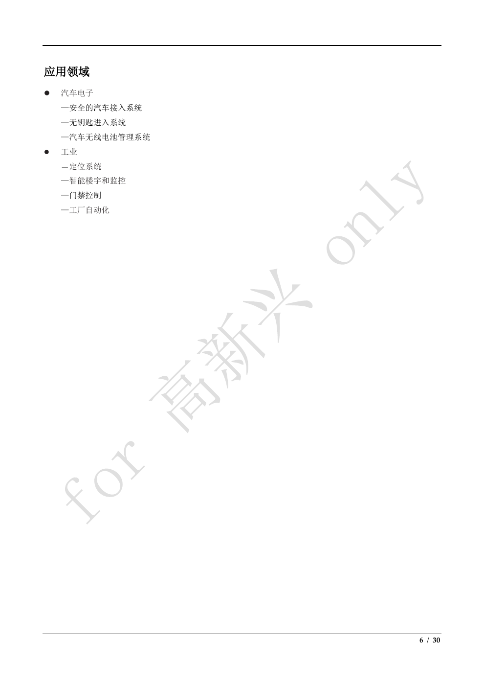

### 原始文字層

```text
应用领域
   汽车电子
    —安全的汽车接入系统
    —无钥匙进入系统
    —汽车无线电池管理系统
   工业
    —定位系统
    —智能楼宇和监控
    —门禁控制
    —工厂自动化


                  6 / 30
```

<a id="pdf-page-07"></a>

## PDF 第 07 頁：訂購資訊

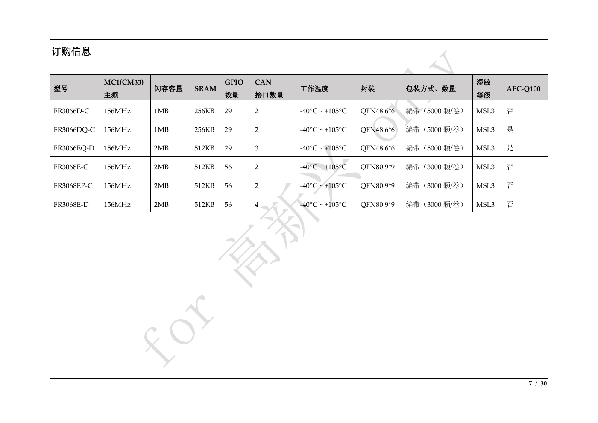

### 原始文字層

```text
订购信息

             MC1(CM33)                  GPIO   CAN                                                湿敏
型号                       闪存容量   SRAM                  工作温度             封装          包装方式、数量               AEC-Q100
             主频                         数量     接口数量                                               等级

FR3066D-C    156MHz      1MB    256KB   29     2      -40°C ~ +105°C   QFN48 6*6   编带（5000 颗/卷）   MSL3   否

FR3066DQ-C   156MHz      1MB    256KB   29     2      -40°C ~ +105°C   QFN48 6*6   编带（5000 颗/卷）   MSL3   是

FR3066EQ-D   156MHz      2MB    512KB   29     3      -40°C ~ +105°C   QFN48 6*6   编带（5000 颗/卷）   MSL3   是

FR3068E-C    156MHz      2MB    512KB   56     2      -40°C ~ +105°C   QFN80 9*9   编带（3000 颗/卷）   MSL3   否

FR3068EP-C   156MHz      2MB    512KB   56     2      -40°C ~ +105°C   QFN80 9*9   编带（3000 颗/卷）   MSL3   否

FR3068E-D    156MHz      2MB    512KB   56     4      -40°C ~ +105°C   QFN80 9*9   编带（3000 颗/卷）   MSL3   否


                                                                                                              7 / 30
```

<a id="pdf-page-08"></a>

## PDF 第 08 頁：功能方塊圖與收發器

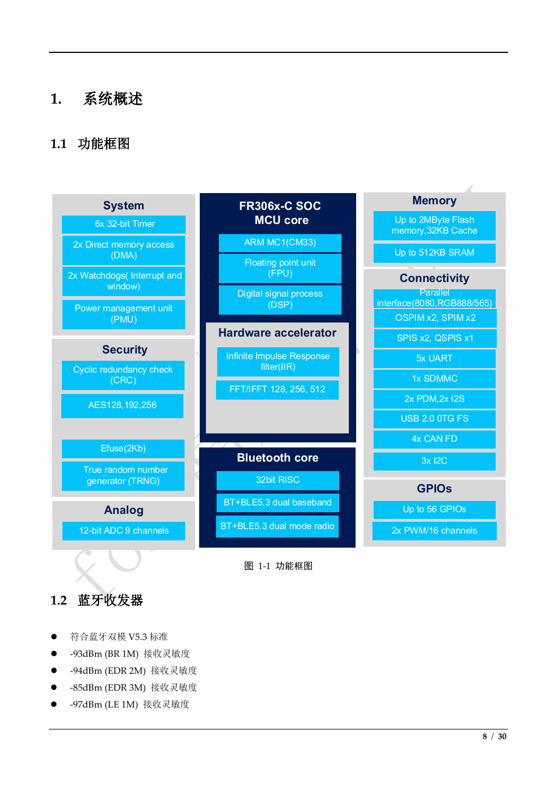

### 原始文字層

```text
1.      系统概述

1.1 功能框图


             System                    FR306x-C SOC                    Memory
           6x 32-bit Timer               MCU core                  Up to 2MByte Flash
                                                                   memory,32KB Cache
      2x Direct memory access           ARM MC1(CM33)
                (DMA)                                              Up to 512KB SRAM
                                        Floating point unit
     2x Watchdogs( Interrupt and              (FPU)
                                                                     Connectivity
             window)
                                      Digital signal process               Parallel
                                               (DSP)            interface(8080,RGB888/565)
      Power management unit
             (PMU)                                                  OSPIM x2, SPIM x2
                                   Hardware accelerator             SPIS x2, QSPIS x1
             Security               Infinite Impulse Response           5x UART
      Cyclic redundancy check                 filter(IIR)
               (CRC)                                                   1x SDMMC
                                    FFT/IFFT 128, 256, 512
                                                                      2x PDM,2x I2S
         AES128,192,256
                                                                     USB 2.0 0TG FS

                                                                       4x CAN FD
            Efuse(2Kb)
                                      Bluetooth core                      3x I2C
        True random number
         generator (TRNG)                  32bit RISC
                                                                        GPIOs
                                   BT+BLE5.3 dual baseband
             Analog                                                  Up to 56 GPIOs

       12-bit ADC 9 channels       BT+BLE5.3 dual mode radio       2x PWM/16 channels


                                        图 1-1 功能框图


1.2 蓝牙收发器

    符合蓝牙双模 V5.3 标准
    -93dBm (BR 1M) 接收灵敏度
    -94dBm (EDR 2M) 接收灵敏度
    -85dBm (EDR 3M) 接收灵敏度
    -97dBm (LE 1M) 接收灵敏度


                                                                                        8 / 30
```

<a id="pdf-page-09"></a>

## PDF 第 09 頁：Bluetooth／CAN 控制器及介面

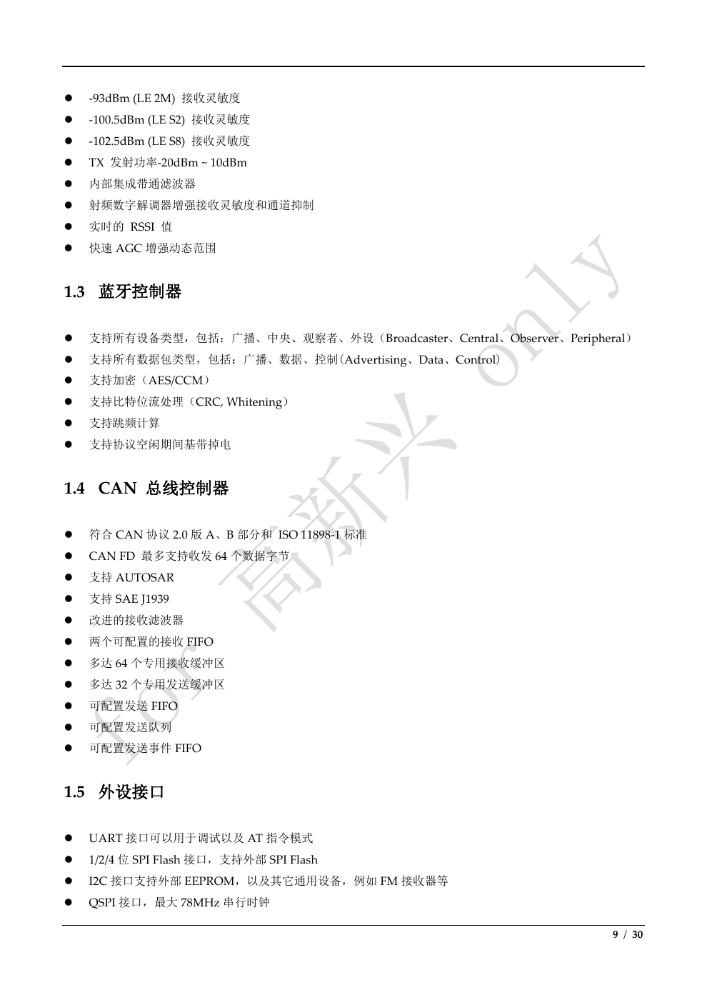

### 原始文字層

```text
   -93dBm (LE 2M) 接收灵敏度
   -100.5dBm (LE S2) 接收灵敏度
   -102.5dBm (LE S8) 接收灵敏度
   TX 发射功率-20dBm ~ 10dBm
   内部集成带通滤波器
   射频数字解调器增强接收灵敏度和通道抑制
   实时的 RSSI 值
   快速 AGC 增强动态范围


1.3 蓝牙控制器

   支持所有设备类型，包括：广播、中央、观察者、外设（Broadcaster、Central、Observer、Peripheral）
   支持所有数据包类型，包括：广播、数据、控制(Advertising、Data、Control)
   支持加密（AES/CCM）
   支持比特位流处理（CRC, Whitening）
   支持跳频计算
   支持协议空闲期间基带掉电


1.4 CAN 总线控制器

   符合 CAN 协议 2.0 版 A、B 部分和 ISO 11898-1 标准
   CAN FD 最多支持收发 64 个数据字节
   支持 AUTOSAR
   支持 SAE J1939
   改进的接收滤波器
   两个可配置的接收 FIFO
   多达 64 个专用接收缓冲区
   多达 32 个专用发送缓冲区
   可配置发送 FIFO
   可配置发送队列
   可配置发送事件 FIFO


1.5 外设接口

   UART 接口可以用于调试以及 AT 指令模式
   1/2/4 位 SPI Flash 接口，支持外部 SPI Flash
   I2C 接口支持外部 EEPROM，以及其它通用设备，例如 FM 接收器等
   QSPI 接口，最大 78MHz 串行时钟

                                                                  9 / 30
```

<a id="pdf-page-10"></a>

## PDF 第 10 頁：介面續頁、PMU 與封裝

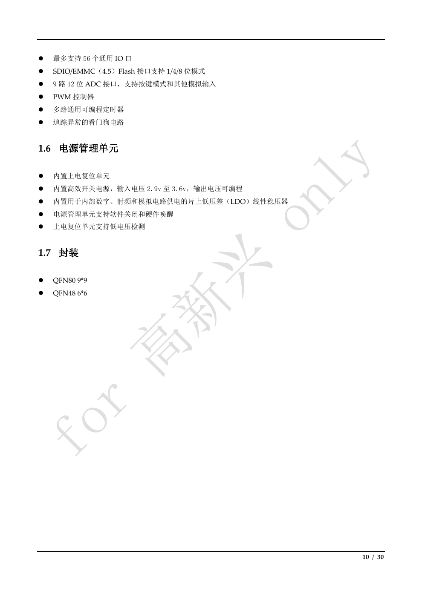

### 原始文字層

```text
   最多支持 56 个通用 IO 口
   SDIO/EMMC（4.5）Flash 接口支持 1/4/8 位模式
   9 路 12 位 ADC 接口，支持按键模式和其他模拟输入
   PWM 控制器
   多路通用可编程定时器
   追踪异常的看门狗电路


1.6 电源管理单元

   内置上电复位单元
   内置高效开关电源，输入电压 2.9v 至 3.6v，输出电压可编程
   内置用于内部数字、射频和模拟电路供电的片上低压差（LDO）线性稳压器
   电源管理单元支持软件关闭和硬件唤醒
   上电复位单元支持低电压检测


1.7 封装

   QFN80 9*9
   QFN48 6*6


                                         10 / 30
```

<a id="pdf-page-11"></a>

## PDF 第 11 頁：QFN48 pin 圖


### 原始文字層

```text
2.      硬件信息

2.1 封装定义


2.1.1   FR3066D-C /FR3066DQ-C / FR3066EQ-D 管脚布局


                                      XI_24M   XO_24M     BT_IOLDO   BT_BFB   BT_BSW   BT_VCC   MCU_VCC   SYS_BSW   SYS_BFB   DVDD_LDO
                               NC                                                                                                        GND


                                48     47       46         45         44       43       42       41        40        39        38        37
                    NC    1                                                                                                                    36   IO3V3_LDO

                   ANT    2                                                                                                                    35   RSTN

             PB0/BT_PA4   3                                                                                                                    34   IO1V8_LDO

             PB1/BT_PA5   4                                                                                                                    33   PP7/PD15

                 RESV0    5                                                                                                                    32   PP6/PD14

             PB3/BT_PA7   6                    FR3066DQ-C                                                                                      31   PP5/PD13

                   PB4    7                                                                                                                    30   PP4/PD12
                                                              QFN48 0606 P0.4
                   PB5    8                                                                                                                    29   PP3/PA5

                   PB6    9                                                                                                                    28   PP2/PA4

                   PB7    10                                                                                                                   27   PD11

                   PB8    11                                                                               EPAD(GND)                           26   PD10

                   PB9    12                                                                                                                   25   PD9
                               13     14       15         16         17       18       19       20        21        22        23         24


                               PB10   PB11                PD0        PD1      PD2      PD3      PD4       PD5       PD6       PD7        PD8

                                               DVDD_1V2


                      图 2-1 FR3066D-C /FR3066DQ-C / FR3066EQ-D 管脚布局图


                                                                                                                                                                11 / 30
```

<a id="pdf-page-12"></a>

## PDF 第 12 頁：QFN80 pin 圖


### 原始文字層

```text
2.1.2     FR3068E-C/FR3068EP-C/FR3068E-D 管脚布局


                                 XI_24M   XO_24M   BT_IOLDO   BT_BFB   BT_BSW   BT_VCC                                 DVDD_1V2                     MCU_VCC     SYS_BSW   SYS_BFB   DVDD_LDO
                          NC                                                             PA7    PA6   PA5   PA4                   PP2   PP3   PP0                                              NC


                           80     79       78       77         76       75      74       73     72    71     70         69        68    67    66    65          64        63        62         61
               NC    1                                                                                                                                                                               60   NA

        AVDD_1V2     2                                                                                                                                                                               59   IO3V3_LDO

              ANT    3                                                                                                                                                                               58   RSTN

              PA10   4                                                                                                                                                                               57   IO1V8_LDO

              PA11   5                                                                                                                                                                               56   PP7

              PA12   6                                                                                                                                                                               55   PP6

              PA13   7                                                                                                                                                                               54   PP5

              PA14   8                                                                                                                                                                               53   PP4

              PA15

        PB0/BT_PA4
                     9

                     10                                           FR3068E-C                                                                                                                          52

                                                                                                                                                                                                     51
                                                                                                                                                                                                          PD15

                                                                                                                                                                                                          PD14

        PB1/BT_PA5   11                                                                                                                                                                              50   PD13

            RESV0    12                                                         QFN80 0909 P0.4                                                                                                      49   PD12

        PB3/BT_PA7   13                                                                                                                                                                              48   PD11

        VDD_IO3V3    14                                                                                                                                                                              47   PD10

               PB4   15                                                                                                                                                                              46   PD9

               PB5   16                                                                                                                                                                              45   PD8

               PB6   17                                                                                                                                                                              44   PD7

               PB7   18                                                                                                                                                                              43   PD6

               PB8   19                                                                                                                                          EPAD(GND)                           42   PD5

               PB9   20                                                                                                                                                                              41   PD4
                           21    22       23        24        25       26       27       28     29    30    31         32         33    34    35    36          37        38        39         40


                          PB10   PB11     PB12     PB13       PB14     PC1      PC0      PB15   PC2   PC3              PC4        PC5   PC6   PC7               PD0       PD1       PD2        PD3

                                                                                                            DVDD_1V2                                VDD_IO1V8


                                          图 2-2 FR3068E-C/FR3068EP-C/FR3068E-D 管脚布局图


                                                                                                                                                                                                                 12 / 30
```

<a id="pdf-page-13"></a>

## PDF 第 13 頁：封裝尺寸

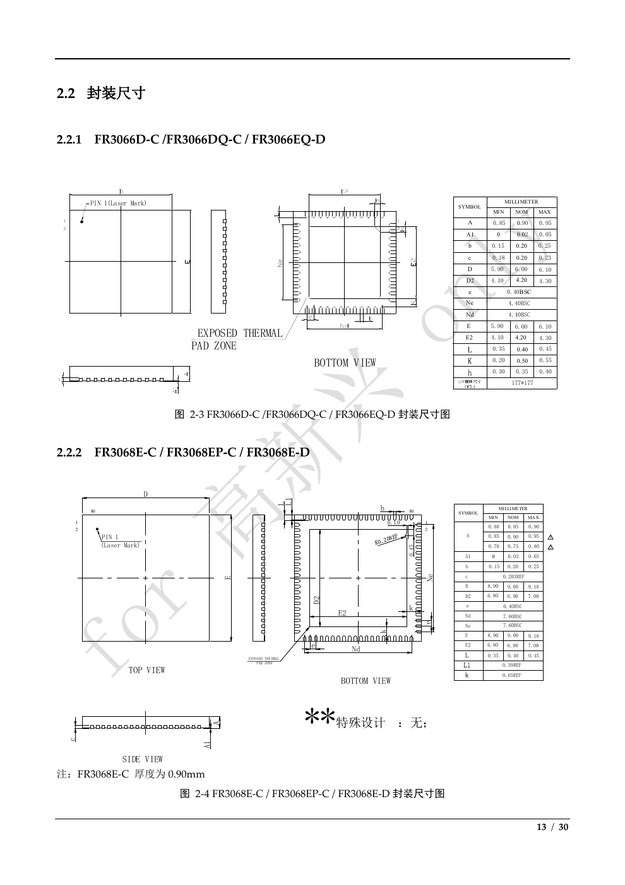

### 原始文字層

```text
2.2 封装尺寸


2.2.1    FR3066D-C /FR3066DQ-C / FR3066EQ-D


        PIN 1(Laser Mark)                                                                                                    MILLIMET ER
                                                                                                          SYMBOL
                                                                                                                      MIN        NOM        MAX
                                                                                                                A     0.85        0.90          0.95
                                                                                                            A1           0        0.02          0.05
                                                                                                                b    0.15         0.20      0.25
                                                                                                                c    0.18         0.20          0.23
                                                                                                            D        5.90        6.00           6.10
                                                                                                            D2       4.10         4.20          4.30
                                                                                                                e             0.40BSC
                                                                                                            Ne                 4.40BSC
                                                                                                            Nd                 4.40BSC
                                                                                                            E        5.90        6.00           6.10
                                   EXPOSED THERMAL                                                          E2       4.10        4.20           4.30
                                  PAD ZONE                                                                           0.35         0.40          0.45
                                                                                                                                  0.50
                                                                    BOTTOM VIEW                                      0.20                       0.55
                                                                                                                     0.30        0.35           0.40
                                                                                                                                177*177


                                图 2-3 FR3066D-C /FR3066DQ-C / FR3066EQ-D 封装尺寸图


2.2.2    FR3068E-C / FR3068EP-C / FR3068E-D


                            D
                                                               L
                                                               L1
        80
                                                                                   b          80          SYMBOL
                                                                                                                           MILLIME TER
                                                                                                                    MIN       NOM        MA X
   1                                                                                   0.10          1
                                                                                                                    0.80      0.85       0.90
   2                                                                                                 2
             PIN 1                                                                                          A       0.85      0.90       0.95      1
             (Laser Mark)                                                                                           0.70      0.75       0.80
                                                                                              0.45
                                                                                                                                                   2
                                                                                                            A1       0         0.02      0.05
                                                                                                            b       0.15      0.20       0.25

                                             E                                                       Ne     c                0.203REF
                                                                                                            D       8.90      9.00       9.10
                                                                                                            D2      6.80      6.90       7.00
                                                                    D2
                                                                                                            e                0.40BSC
                                                                                              k
                                                                         E2                                 Nd               7.60BSC
                                                                                                     e      Ne               7.60BSC
                                                                                   k
                                                                                                            E       8.90      9.00       9.10
                                                                    e         Nd
                                                                                                            E2      6.80      6.90       7.00

                                                 EXPOSED THE RMAL
                                                                                                                    0.35      0.40       0.45
                                                     PAD ZONE
                                                                                                                             0.39REF
                     TOP VIEW                                                                                                0.65REF
                                                                         BOTTOM VIEW


  c
                                         A                          **特殊设计 ：无；
                                    A1
                   SIDE VIEW
注：FR3068E-C 厚度为 0.90mm
                                图 2-4 FR3068E-C / FR3068EP-C / FR3068E-D 封装尺寸图


                                                                                                                                            13 / 30
```

<a id="pdf-page-14"></a>

## PDF 第 14 頁：pin 類型與 QFN48 pin 1-21

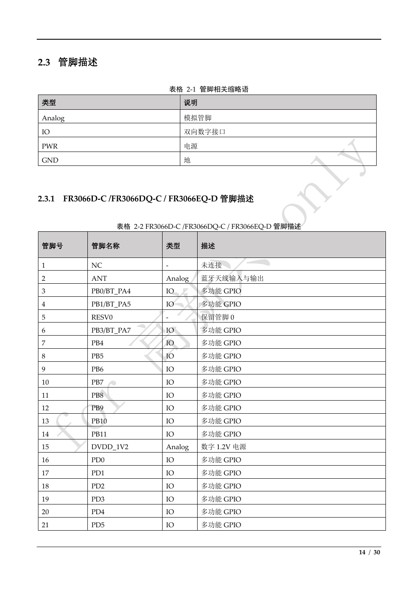

### 原始文字層

```text
2.3 管脚描述

                                     表格 2-1 管脚相关缩略语
 类型                                    说明

 Analog                                模拟管脚
 IO                                    双向数字接口

 PWR                                   电源
 GND                                   地


2.3.1   FR3066D-C /FR3066DQ-C / FR3066EQ-D 管脚描述


                     表格 2-2 FR3066D-C /FR3066DQ-C / FR3066EQ-D 管脚描述

 管脚号         管脚名称                类型         描述

 1           NC                  -          未连接
 2           ANT                 Analog     蓝牙天线输入与输出
 3           PB0/BT_PA4          IO         多功能 GPIO
 4           PB1/BT_PA5          IO         多功能 GPIO
 5           RESV0               -          保留管脚 0
 6           PB3/BT_PA7          IO         多功能 GPIO
 7           PB4                 IO         多功能 GPIO
 8           PB5                 IO         多功能 GPIO
 9           PB6                 IO         多功能 GPIO
 10          PB7                 IO         多功能 GPIO
 11          PB8                 IO         多功能 GPIO
 12          PB9                 IO         多功能 GPIO
 13          PB10                IO         多功能 GPIO
 14          PB11                IO         多功能 GPIO
 15          DVDD_1V2            Analog     数字 1.2V 电源
 16          PD0                 IO         多功能 GPIO
 17          PD1                 IO         多功能 GPIO
 18          PD2                 IO         多功能 GPIO
 19          PD3                 IO         多功能 GPIO
 20          PD4                 IO         多功能 GPIO
 21          PD5                 IO         多功能 GPIO


                                                                      14 / 30
```

<a id="pdf-page-15"></a>

## PDF 第 15 頁：QFN48 pin 22-48／QFN80 pin 1

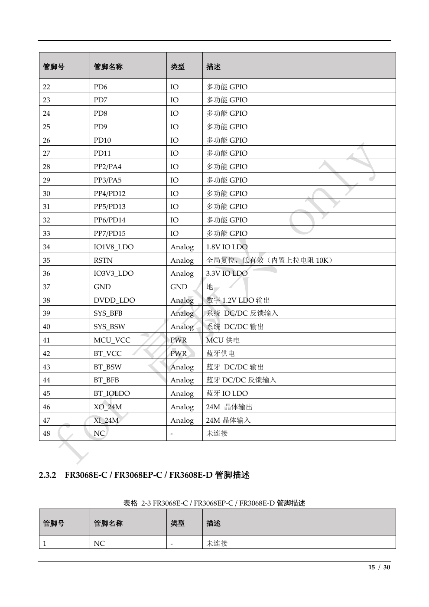

### 原始文字層

```text
 管脚号          管脚名称                 类型       描述

 22           PD6                  IO       多功能 GPIO
 23           PD7                  IO       多功能 GPIO
 24           PD8                  IO       多功能 GPIO
 25           PD9                  IO       多功能 GPIO
 26           PD10                 IO       多功能 GPIO
 27           PD11                 IO       多功能 GPIO
 28           PP2/PA4              IO       多功能 GPIO
 29           PP3/PA5              IO       多功能 GPIO
 30           PP4/PD12             IO       多功能 GPIO
 31           PP5/PD13             IO       多功能 GPIO
 32           PP6/PD14             IO       多功能 GPIO
 33           PP7/PD15             IO       多功能 GPIO
 34           IO1V8_LDO            Analog   1.8V IO LDO
 35           RSTN                 Analog   全局复位，低有效（内置上拉电阻 10K）
 36           IO3V3_LDO            Analog   3.3V IO LDO
 37           GND                  GND      地
 38           DVDD_LDO             Analog   数字 1.2V LDO 输出
 39           SYS_BFB              Analog   系统 DC/DC 反馈输入
 40           SYS_BSW              Analog   系统 DC/DC 输出
 41           MCU_VCC              PWR      MCU 供电
 42           BT_VCC               PWR      蓝牙供电
 43           BT_BSW               Analog   蓝牙 DC/DC 输出
 44           BT_BFB               Analog   蓝牙 DC/DC 反馈输入
 45           BT_IOLDO             Analog   蓝牙 IO LDO
 46           XO_24M               Analog   24M 晶体输出
 47           XI_24M               Analog   24M 晶体输入
 48           NC                   -        未连接


2.3.2   FR3068E-C / FR3068EP-C / FR3608E-D 管脚描述


                        表格 2-3 FR3068E-C / FR3068EP-C / FR3068E-D 管脚描述

 管脚号          管脚名称                 类型       描述

 1            NC                   -        未连接


                                                                         15 / 30
```

<a id="pdf-page-16"></a>

## PDF 第 16 頁：QFN80 pin 2-36

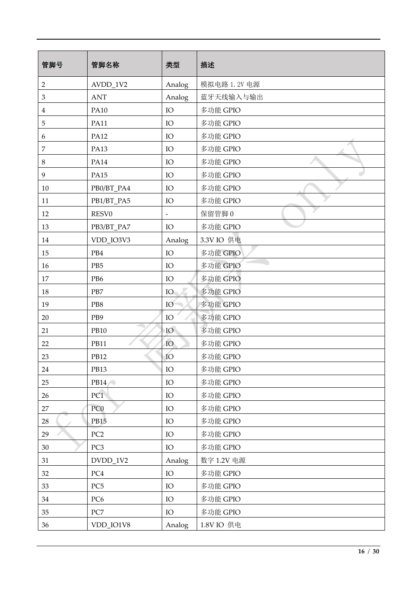

### 原始文字層

```text
管脚号   管脚名称         类型       描述

2     AVDD_1V2     Analog   模拟电路 1.2V 电源
3     ANT          Analog   蓝牙天线输入与输出
4     PA10         IO       多功能 GPIO
5     PA11         IO       多功能 GPIO
6     PA12         IO       多功能 GPIO
7     PA13         IO       多功能 GPIO
8     PA14         IO       多功能 GPIO
9     PA15         IO       多功能 GPIO
10    PB0/BT_PA4   IO       多功能 GPIO
11    PB1/BT_PA5   IO       多功能 GPIO
12    RESV0        -        保留管脚 0
13    PB3/BT_PA7   IO       多功能 GPIO
14    VDD_IO3V3    Analog   3.3V IO 供电
15    PB4          IO       多功能 GPIO
16    PB5          IO       多功能 GPIO
17    PB6          IO       多功能 GPIO
18    PB7          IO       多功能 GPIO
19    PB8          IO       多功能 GPIO
20    PB9          IO       多功能 GPIO
21    PB10         IO       多功能 GPIO
22    PB11         IO       多功能 GPIO
23    PB12         IO       多功能 GPIO
24    PB13         IO       多功能 GPIO
25    PB14         IO       多功能 GPIO
26    PC1          IO       多功能 GPIO
27    PC0          IO       多功能 GPIO
28    PB15         IO       多功能 GPIO
29    PC2          IO       多功能 GPIO
30    PC3          IO       多功能 GPIO
31    DVDD_1V2     Analog   数字 1.2V 电源
32    PC4          IO       多功能 GPIO
33    PC5          IO       多功能 GPIO
34    PC6          IO       多功能 GPIO
35    PC7          IO       多功能 GPIO
36    VDD_IO1V8    Analog   1.8V IO 供电


                                           16 / 30
```

<a id="pdf-page-17"></a>

## PDF 第 17 頁：QFN80 pin 37-71

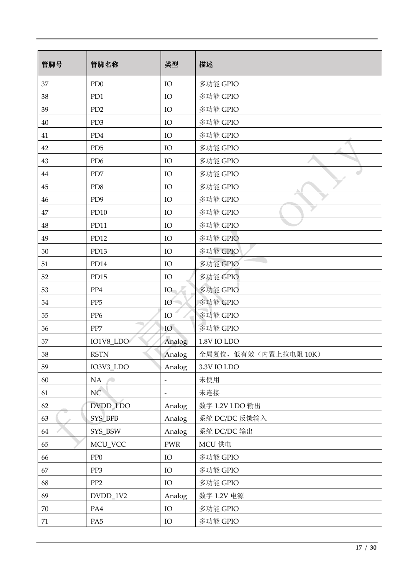

### 原始文字層

```text
管脚号   管脚名称        类型       描述

37    PD0         IO       多功能 GPIO
38    PD1         IO       多功能 GPIO
39    PD2         IO       多功能 GPIO
40    PD3         IO       多功能 GPIO
41    PD4         IO       多功能 GPIO
42    PD5         IO       多功能 GPIO
43    PD6         IO       多功能 GPIO
44    PD7         IO       多功能 GPIO
45    PD8         IO       多功能 GPIO
46    PD9         IO       多功能 GPIO
47    PD10        IO       多功能 GPIO
48    PD11        IO       多功能 GPIO
49    PD12        IO       多功能 GPIO
50    PD13        IO       多功能 GPIO
51    PD14        IO       多功能 GPIO
52    PD15        IO       多功能 GPIO
53    PP4         IO       多功能 GPIO
54    PP5         IO       多功能 GPIO
55    PP6         IO       多功能 GPIO
56    PP7         IO       多功能 GPIO
57    IO1V8_LDO   Analog   1.8V IO LDO
58    RSTN        Analog   全局复位，低有效（内置上拉电阻 10K）
59    IO3V3_LDO   Analog   3.3V IO LDO
60    NA          -        未使用
61    NC          -        未连接
62    DVDD_LDO    Analog   数字 1.2V LDO 输出
63    SYS_BFB     Analog   系统 DC/DC 反馈输入
64    SYS_BSW     Analog   系统 DC/DC 输出
65    MCU_VCC     PWR      MCU 供电
66    PP0         IO       多功能 GPIO
67    PP3         IO       多功能 GPIO
68    PP2         IO       多功能 GPIO
69    DVDD_1V2    Analog   数字 1.2V 电源
70    PA4         IO       多功能 GPIO
71    PA5         IO       多功能 GPIO


                                                  17 / 30
```

<a id="pdf-page-18"></a>

## PDF 第 18 頁：QFN80 pin 72-80

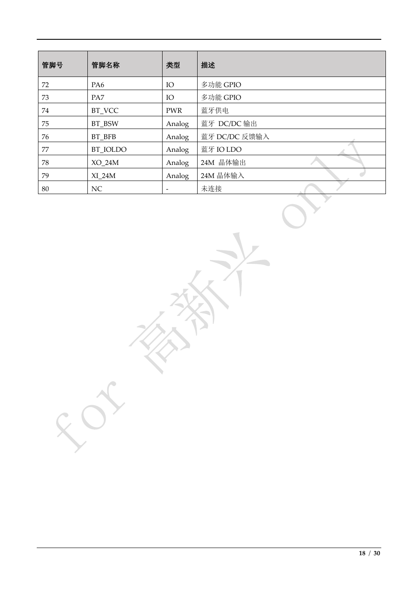

### 原始文字層

```text
管脚号   管脚名称       类型       描述

72    PA6        IO       多功能 GPIO
73    PA7        IO       多功能 GPIO
74    BT_VCC     PWR      蓝牙供电
75    BT_BSW     Analog   蓝牙 DC/DC 输出
76    BT_BFB     Analog   蓝牙 DC/DC 反馈输入
77    BT_IOLDO   Analog   蓝牙 IO LDO
78    XO_24M     Analog   24M 晶体输出
79    XI_24M     Analog   24M 晶体输入
80    NC         -        未连接


                                          18 / 30
```

<a id="pdf-page-19"></a>

## PDF 第 19 頁：RF 範圍與 BR

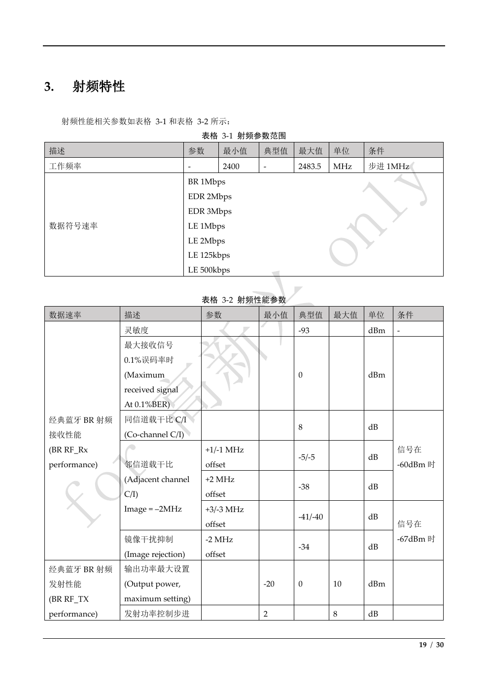

### 原始文字層

```text
3.    射频特性

     射频性能相关参数如表格 3-1 和表格 3-2 所示：
                                       表格 3-1 射频参数范围
描述                                 参数        最小值    典型值   最大值       单位    条件
工作频率                               -         2400   -     2483.5    MHz   步进 1MHz
                                   BR 1Mbps
                                   EDR 2Mbps
                                   EDR 3Mbps
数据符号速率                             LE 1Mbps
                                   LE 2Mbps
                                   LE 125kbps
                                   LE 500kbps


                                       表格 3-2 射频性能参数
数据速率           描述                       参数          最小值   典型值       最大值   单位    条件
               灵敏度                                        -93             dBm   -
               最大接收信号
               0.1%误码率时
               (Maximum                                   0               dBm
               received signal
               At 0.1%BER)
经典蓝牙 BR 射频     同信道载干比 C/I
                                                          8               dB
接收性能           (Co-channel C/I)
(BR RF_Rx                               +1/-1 MHz                               信号在
                                                          -5/-5           dB
performance)   邻信道载干比                   offset                                  -60dBm 时
               (Adjacent channel        +2 MHz
                                                          -38             dB
               C/I)                     offset
               Image = –2MHz            +3/-3 MHz
                                                          -41/-40         dB
                                        offset                                  信号在
               镜像干扰抑制                   -2 MHz                                  -67dBm 时
                                                          -34             dB
               (Image rejection)        offset
经典蓝牙 BR 射频     输出功率最大设置
发射性能           (Output power,                       -20   0         10    dBm
(BR RF_TX      maximum setting)
performance)   发射功率控制步进                             2               8     dB


                                                                                     19 / 30
```

<a id="pdf-page-20"></a>

## PDF 第 20 頁：BR 發射／EDR 接收

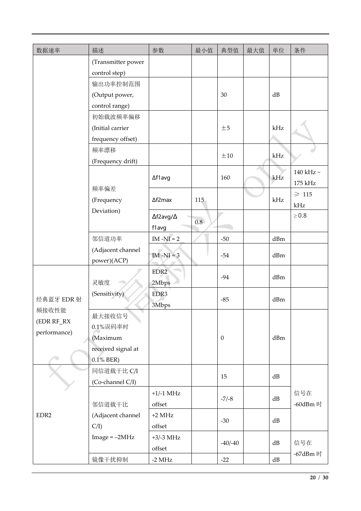

### 原始文字層

```text
数据速率           描述                   参数           最小值   典型值       最大值   单位    条件
               (Transmitter power
               control step)
               输出功率控制范围
               (Output power,                          30              dB
               control range)
               初始载波频率偏移
               (Initial carrier                        ±5              kHz
               frequency offset)
               频率漂移
                                                       ±10             kHz
               (Frequency drift)
                                                                             140 kHz ~
                                    Δf1avg             160             kHz
                                                                             175 kHz
               频率偏差
                                                                             ≥ 115
               (Frequency           Δf2max       115                   kHz
                                                                             kHz
               Deviation)
                                    Δf2avg/Δ                                 ≥ 0.8
                                                 0.8
                                    f1avg

               邻信道功率                IM -NI = 2         -50             dBm
               (Adjacent channel
                                    IM -NI = 3         -54             dBm
               power)(ACP)
                                    EDR2
                                                       -94             dBm
               灵敏度                  2Mbps
               (Sensitivity)        EDR3
经典蓝牙 EDR 射                                             -85             dBm
                                    3Mbps
频接收性能
               最大接收信号
(EDR RF_RX
               0.1%误码率时
performance)
               (Maximum                                0               dBm
               received signal at
               0.1% BER)
               同信道载干比 C/I
                                                       15              dB
               (Co-channel C/I)
                                    +1/-1 MHz                                信号在
                                                       -7/-8           dB
               邻信道载干比               offset                                   -60dBm 时
EDR2           (Adjacent channel    +2 MHz
                                                       -30             dB
               C/I)                 offset
               Image = –2MHz        +3/-3 MHz
                                                       -40/-40         dB    信号在
                                    offset
                                                                             -67dBm 时
               镜像干扰抑制               -2 MHz             -22             dB

                                                                                     20 / 30
```

<a id="pdf-page-21"></a>

## PDF 第 21 頁：EDR 接收／發射

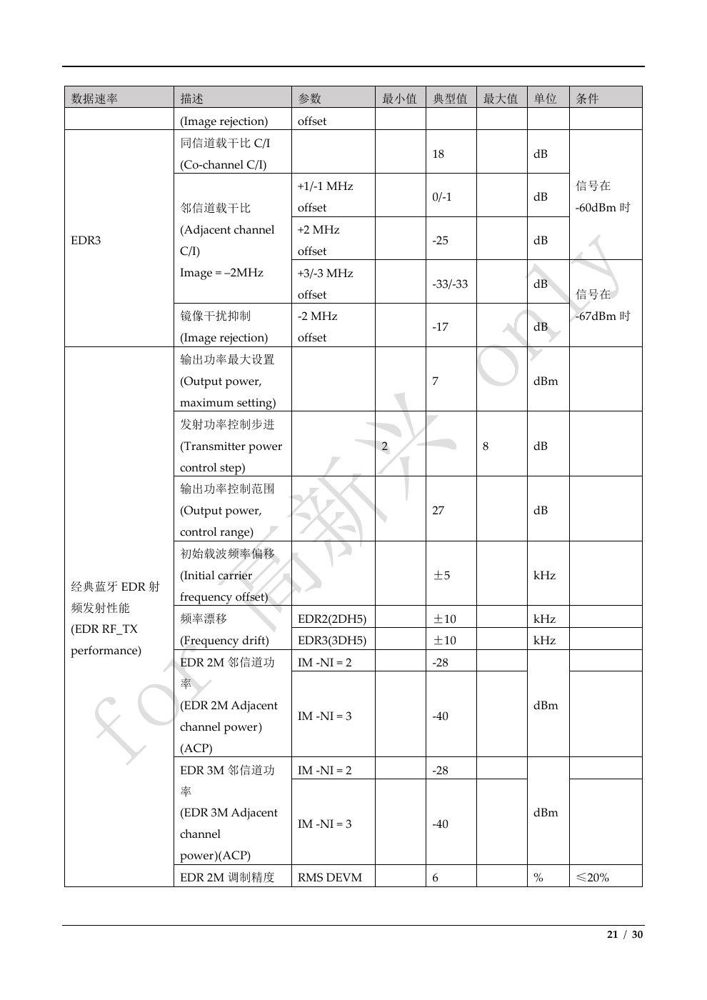

### 原始文字層

```text
数据速率           描述                   参数           最小值   典型值       最大值   单位    条件
               (Image rejection)    offset
               同信道载干比 C/I
                                                       18              dB
               (Co-channel C/I)
                                    +1/-1 MHz                                信号在
                                                       0/-1            dB
               邻信道载干比               offset                                   -60dBm 时
               (Adjacent channel    +2 MHz
EDR3                                                   -25             dB
               C/I)                 offset
               Image = –2MHz        +3/-3 MHz
                                                       -33/-33         dB
                                    offset                                   信号在
               镜像干扰抑制               -2 MHz                                   -67dBm 时
                                                       -17             dB
               (Image rejection)    offset
               输出功率最大设置
               (Output power,                          7               dBm
               maximum setting)
               发射功率控制步进
               (Transmitter power                2               8     dB
               control step)
               输出功率控制范围
               (Output power,                          27              dB
               control range)
               初始载波频率偏移
               (Initial carrier                        ±5              kHz
经典蓝牙 EDR 射
               frequency offset)
频发射性能
               频率漂移                 EDR2(2DH5)         ±10             kHz
(EDR RF_TX
               (Frequency drift)    EDR3(3DH5)         ±10             kHz
performance)
               EDR 2M 邻信道功          IM -NI = 2         -28
               率
               (EDR 2M Adjacent                                        dBm
                                    IM -NI = 3         -40
               channel power)
               (ACP)
               EDR 3M 邻信道功          IM -NI = 2         -28
               率
               (EDR 3M Adjacent                                        dBm
                                    IM -NI = 3         -40
               channel
               power)(ACP)
               EDR 2M 调制精度          RMS DEVM           6               %     ≤20%


                                                                                  21 / 30
```

<a id="pdf-page-22"></a>

## PDF 第 22 頁：EDR 調變／BLE 1M／2M

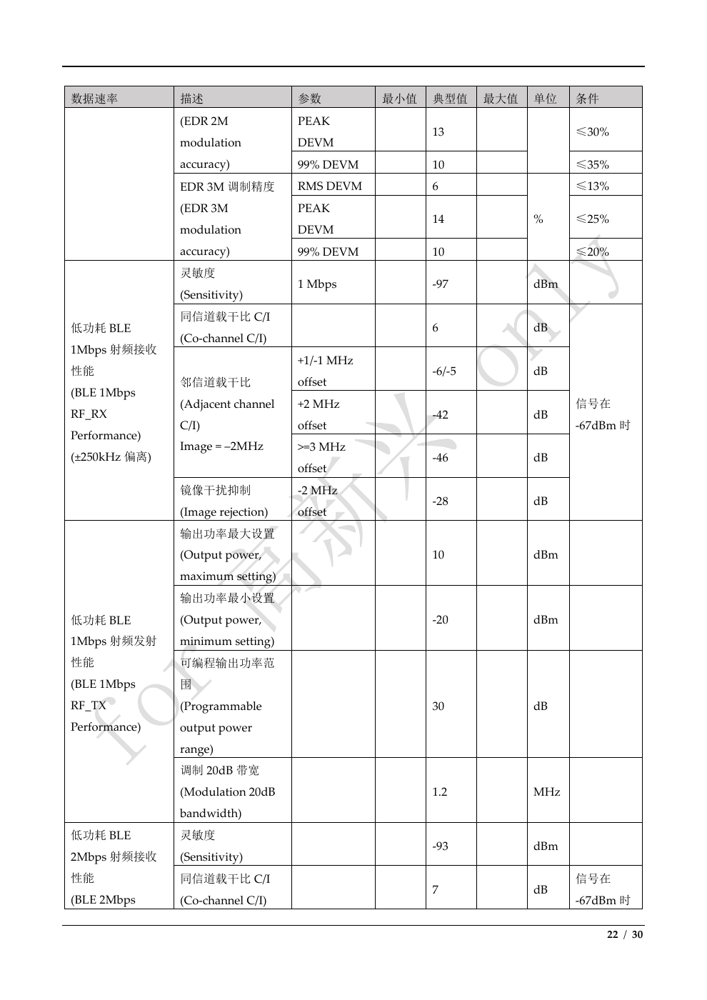

### 原始文字層

```text
数据速率           描述                  参数          最小值   典型值     最大值   单位    条件
               (EDR 2M             PEAK
                                                     13                  ≤30%
               modulation          DEVM
               accuracy)           99% DEVM          10                  ≤35%
               EDR 3M 调制精度         RMS DEVM          6                   ≤13%
               (EDR 3M             PEAK
                                                     14            %     ≤25%
               modulation          DEVM
               accuracy)           99% DEVM          10                  ≤20%
               灵敏度
                                   1 Mbps            -97           dBm
               (Sensitivity)
               同信道载干比 C/I
低功耗 BLE                                              6             dB
               (Co-channel C/I)
1Mbps 射频接收
                                   +1/-1 MHz
性能                                                   -6/-5         dB
               邻信道载干比              offset
(BLE 1Mbps
               (Adjacent channel   +2 MHz                                信号在
RF_RX                                                -42           dB
               C/I)                offset                                -67dBm 时
Performance)
               Image = –2MHz       >=3 MHz
(±250kHz 偏离)                                         -46           dB
                                   offset
               镜像干扰抑制              -2 MHz
                                                     -28           dB
               (Image rejection)   offset
               输出功率最大设置
               (Output power,                        10            dBm
               maximum setting)
               输出功率最小设置
低功耗 BLE        (Output power,                        -20           dBm
1Mbps 射频发射     minimum setting)
性能             可编程输出功率范
(BLE 1Mbps     围
RF_TX          (Programmable                         30            dB
Performance)   output power
               range)
               调制 20dB 带宽
               (Modulation 20dB                      1.2           MHz
               bandwidth)
低功耗 BLE        灵敏度
                                                     -93           dBm
2Mbps 射频接收     (Sensitivity)
性能             同信道载干比 C/I                                                信号在
                                                     7             dB
(BLE 2Mbps     (Co-channel C/I)                                          -67dBm 时

                                                                              22 / 30
```

<a id="pdf-page-23"></a>

## PDF 第 23 頁：BLE 2M／500 kbps

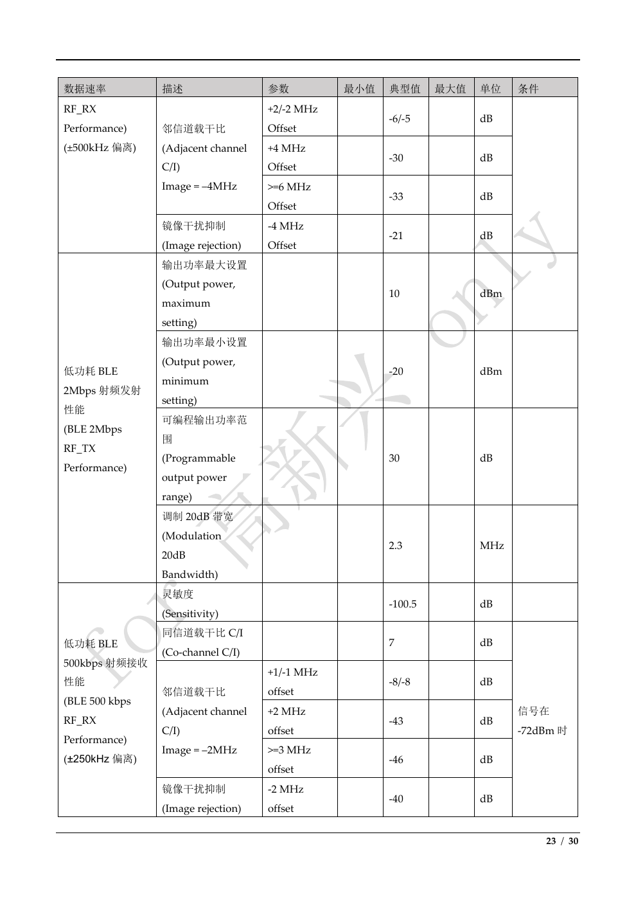

### 原始文字層

```text
数据速率            描述                  参数          最小值   典型值      最大值   单位    条件
RF_RX                               +2/-2 MHz
                                                      -6/-5          dB
Performance)    邻信道载干比              Offset
(±500kHz 偏离)    (Adjacent channel   +4 MHz
                                                      -30            dB
                C/I)                Offset
                Image = –4MHz       >=6 MHz
                                                      -33            dB
                                    Offset
                镜像干扰抑制              -4 MHz
                                                      -21            dB
                (Image rejection)   Offset
                输出功率最大设置
                (Output power,
                                                      10             dBm
                maximum
                setting)
                输出功率最小设置
                (Output power,
低功耗 BLE                                               -20            dBm
                minimum
2Mbps 射频发射
                setting)
性能
                可编程输出功率范
(BLE 2Mbps
                围
RF_TX
                (Programmable                         30             dB
Performance)
                output power
                range)
                调制 20dB 带宽
                (Modulation
                                                      2.3            MHz
                20dB
                Bandwidth)
                灵敏度
                                                      -100.5         dB
                (Sensitivity)
                同信道载干比 C/I
低功耗 BLE                                               7              dB
                (Co-channel C/I)
500kbps 射频接收
                                    +1/-1 MHz
性能                                                    -8/-8          dB
                邻信道载干比              offset
(BLE 500 kbps
                (Adjacent channel   +2 MHz                                 信号在
RF_RX                                                 -43            dB
                C/I)                offset                                 -72dBm 时
Performance)
                Image = –2MHz       >=3 MHz
(±250kHz 偏离)                                          -46            dB
                                    offset
                镜像干扰抑制              -2 MHz
                                                      -40            dB
                (Image rejection)   offset

                                                                                23 / 30
```

<a id="pdf-page-24"></a>

## PDF 第 24 頁：BLE 500／125 kbps

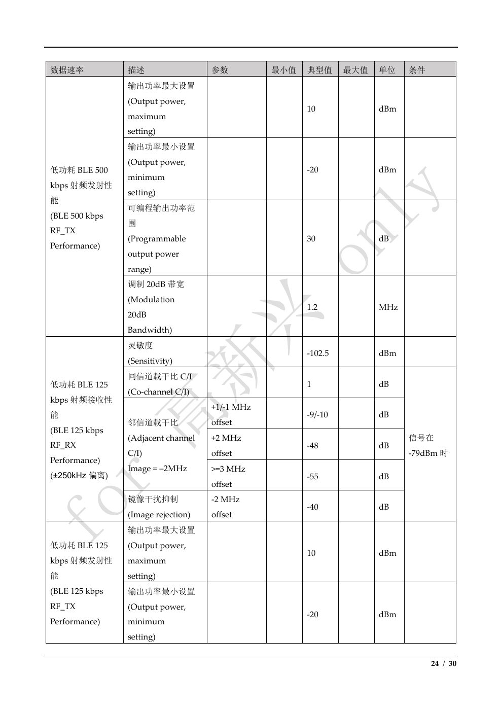

### 原始文字層

```text
数据速率            描述                  参数          最小值   典型值      最大值   单位    条件
                输出功率最大设置
                (Output power,
                                                      10             dBm
                maximum
                setting)
                输出功率最小设置
                (Output power,
低功耗 BLE 500                                           -20            dBm
                minimum
kbps 射频发射性
                setting)
能
                可编程输出功率范
(BLE 500 kbps
                围
RF_TX
                (Programmable                         30             dB
Performance)
                output power
                range)
                调制 20dB 带宽
                (Modulation
                                                      1.2            MHz
                20dB
                Bandwidth)
                灵敏度
                                                      -102.5         dBm
                (Sensitivity)
                同信道载干比 C/I
低功耗 BLE 125                                           1              dB
                (Co-channel C/I)
kbps 射频接收性
                                    +1/-1 MHz
能                                                     -9/-10         dB
                邻信道载干比              offset
(BLE 125 kbps
                (Adjacent channel   +2 MHz                                 信号在
RF_RX                                                 -48            dB
                C/I)                offset                                 -79dBm 时
Performance)
                Image = –2MHz       >=3 MHz
(±250kHz 偏离)                                          -55            dB
                                    offset
                镜像干扰抑制              -2 MHz
                                                      -40            dB
                (Image rejection)   offset
                输出功率最大设置
低功耗 BLE 125     (Output power,
                                                      10             dBm
kbps 射频发射性      maximum
能               setting)
(BLE 125 kbps   输出功率最小设置
RF_TX           (Output power,
                                                      -20            dBm
Performance)    minimum
                setting)


                                                                                24 / 30
```

<a id="pdf-page-25"></a>

## PDF 第 25 頁：BLE 125 kbps 續頁

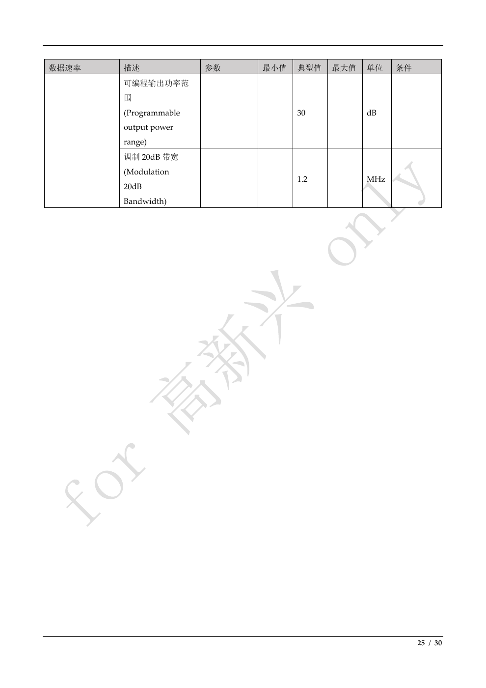

### 原始文字層

```text
数据速率   描述              参数   最小值   典型值   最大值   单位    条件
       可编程输出功率范
       围
       (Programmable              30          dB
       output power
       range)
       调制 20dB 带宽
       (Modulation
                                  1.2         MHz
       20dB
       Bandwidth)


                                                         25 / 30
```

<a id="pdf-page-26"></a>

## PDF 第 26 頁：上下電條件與工作電壓


### 原始文字層

```text
4.    电气特性

4.1 上下电工作条件


      POWON_VTH 2.9V
      BOR_VTH 2.4V


              VCC
                       5 us < TR < 10 m s         D ev i ce wo r ki n g          T D> 2 0m s 5 us < TR < 10 m s


                                             图 4-1 上下电工作时序图


                                            表格 4-1 上下电工作时序条件
参数                           描述及条件
VCC                           系统电源
POWON_VTH                     系统上电启动电压
BOR_VTH                      系统掉电复位电压
TR                           系统电源 VCC 上电时间。要求大于 5us，小于 10ms
TD                           VCC 电压低于 BOR_VTH 后需要等待 TD 大于 20ms，系统内部有效复位。


4.2 建议工作条件

                                             表格 4-2 建议工作条件
建议工作条件                                          最小值                       典型值         最大值                         单位
工作温度范围                                          -40                       25          105                         ℃
                             IO3V3_LDO          2.9                       3.3         3.6                         V
                             MIC_BIAS           1.8                       2.8         2.8                         V
                             IO1V8_LDO          1.65                      1.8         2.0                         V
输出电压                         SYS_BFB            1.35                      1.4         1.5                         V
                             DVDD_LDO           1.15                      1.2         1.25                        V
                             BT_IOLDO           2.9                       3.3         3.6                         V
                             BT_BFB             1.2                       1.25        1.4                         V

                                                                                                                       26 / 30
```

<a id="pdf-page-27"></a>

## PDF 第 27 頁：供電、電流、IO

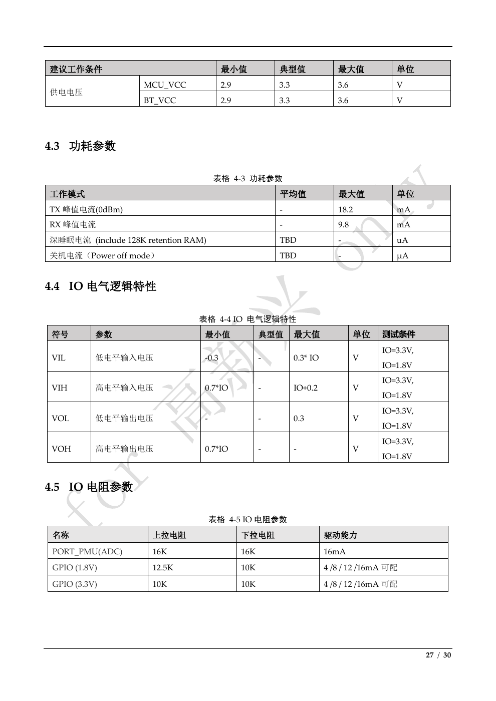

### 原始文字層

```text
建议工作条件                                  最小值             典型值                最大值           单位
                    MCU_VCC             2.9             3.3                3.6           V
供电电压
                    BT_VCC              2.9             3.3                3.6           V


4.3 功耗参数

                                     表格 4-3 功耗参数
工作模式                                                    平均值                最大值           单位
TX 峰值电流(0dBm)                                           -                  18.2          mA
RX 峰值电流                                                 -                  9.8           mA
深睡眠电流 (include 128K retention RAM)                      TBD                -             uA
关机电流（Power off mode）                                    TBD                -             µA


4.4 IO 电气逻辑特性

                                表格 4-4 IO 电气逻辑特性
符号        参数                     最小值                典型值       最大值                单位   测试条件
                                                                                      IO=3.3V,
VIL       低电平输入电压                -0.3               -         0.3* IO            V
                                                                                      IO=1.8V
                                                                                      IO=3.3V,
VIH       高电平输入电压                0.7*IO             -         IO+0.2             V
                                                                                      IO=1.8V
                                                                                      IO=3.3V,
VOL       低电平输出电压                -                  -         0.3                V
                                                                                      IO=1.8V
                                                                                      IO=3.3V,
VOH       高电平输出电压                0.7*IO             -         -                  V
                                                                                      IO=1.8V


4.5 IO 电阻参数

                                     表格 4-5 IO 电阻参数
名称                    上拉电阻                    下拉电阻                      驱动能力
PORT_PMU(ADC)         16K                     16K                       16mA
GPIO (1.8V)           12.5K                   10K                       4 /8 / 12 /16mA 可配
GPIO (3.3V)           10K                     10K                       4 /8 / 12 /16mA 可配


                                                                                                 27 / 30
```

<a id="pdf-page-28"></a>

## PDF 第 28 頁：時鐘、Buck 與 ESD

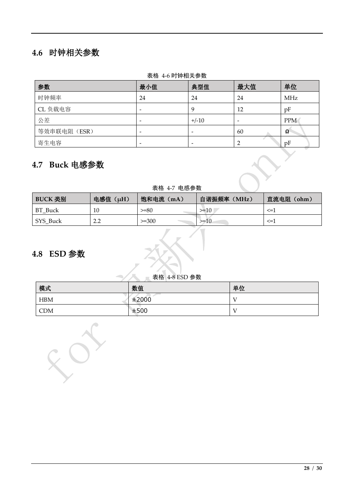

### 原始文字層

```text
4.6 时钟相关参数

                            表格 4-6 时钟相关参数
 参数                    最小值             典型值             最大值         单位
 时钟频率                  24              24              24          MHz
 CL 负载电容               -               9               12          pF
 公差                    -               +/-10           -           PPM
 等效串联电阻（ESR）           -               -               60          Ω
 寄生电容                  -               -               2           pF


4.7 Buck 电感参数

                             表格 4-7 电感参数
BUCK 类别      电感值（µH）   饱和电流（mA）             自谐振频率（MHz）       直流电阻（ohm）
BT_Buck      10        >=80                 >=10             <=1
SYS_Buck     2.2       >=300                >=10             <=1


4.8 ESD 参数

                             表格 4-8 ESD 参数
 模式                数值                              单位
 HBM               ±2000                           V
 CDM               ±500                            V


                                                                         28 / 30
```

<a id="pdf-page-29"></a>

## PDF 第 29 頁：縮寫

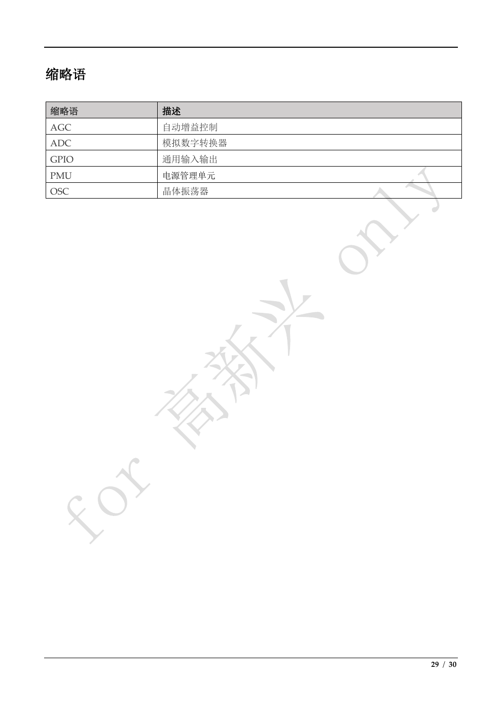

### 原始文字層

```text
缩略语

缩略语    描述
AGC    自动增益控制
ADC    模拟数字转换器
GPIO   通用输入输出
PMU    电源管理单元
OSC    晶体振荡器


                 29 / 30
```

<a id="pdf-page-30"></a>

## PDF 第 30 頁：原廠聯絡與版本歷史


### 原始文字層

```text
联系信息

公司：上海富芮坤微电子有限公司
地址：中国(上海)自由贸易试验区碧波路 912 弄 8 号 501-A 室
电话：+86-21-5027-0080
网址:       www.freqchip.com
销售邮箱:sales@freqchip.com
文档邮箱:docs@freqchip.com


版本修订

 Reversion Number      Reversion Date   Description
 V0.1                  2024.04.09       初版
 V0.2                  2024.04.19       增加 FR3066DQ
                                        修改章节 2.3S
 V0.2.1                2024.05.07       修改章节 2.1.2，2.3.2
 V0.2.2                2024.06.25       增加章节 4.1 上下电时序
 V0.2.3                2024.08.07       修改章节 1.1 框图
 V0.3.0                2024.09.09       修改第二章节 Pinout
 V0.3.1                2024.11.07       增加 AEC-Q100 及 CAN FD 信息
 V0.3.2                2024.12.25       更新订购信息
 V0.4.0                2025.01.15       修改 CAN FD 信息
                                        更新 FR3066DQ-C 的 PB0,PB1 功能，增加
 V0.4.1                2025.02.10
                                        MCAN2 功能
 V0.4.2                2025.02.21       增加 4.5 章节 IO 电阻参数
 V0.4.3                2025.03.05       增加型号 FR3068E-D / FR3066E-D
 V0.4.4                2025.05.26       修改 FR3068E-C pin
 V0.4.5                2025.06.10       增加型号 FR3066EQ-D
 V0.4.6                2025.06.30       增加型号 FR3066D-C
 V0.4.7                2025.07.15       增加型号 FR3068EP-C
 V0.4.8                2025.07.28       修改 FR306x-C 为 FR306x 系列
 V0.4.9                2025.09.16       增加 ESD 参数


                                                                        30 / 30
```
